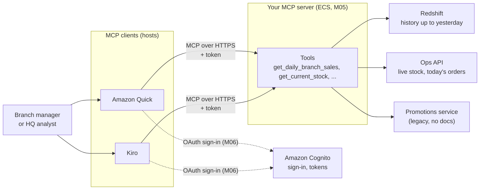

# D1 M00 — MCP Fundamentals (30m)

## Before M00: Python reading warm-up (15m, 08:30–08:45)
For participants who skipped pre-work; others can check their laptop setup or read ahead.

1. Open [prework/python-reading-primer.md](../prework/python-reading-primer.md) and read Parts 1, 4 and 5: reading a function, f-strings vs parameterised SQL, and `ToolError`.
2. Do quiz questions 2, 5, 6 and 7.
3. Instructor: walk through `get_daily_branch_sales` in `solutions/mcp-server/tools/redshift_tools.py` on screen: decorator, docstring (= tool description), `:name` parameters, `LIMIT`.

The full primer and the [Kiro review guide](../prework/kiro-guide.md) stay available as reference all day.

## Objectives
- Explain host, client, server roles.
- Distinguish tools, resources, prompts.
- Know when stdio vs Streamable HTTP transport applies.

## Content
1. **Problem** (5m): every AI app writing its own integration to Redshift, POS, Inventory. MCP = one standard interface, many clients (Kiro, Quick, agents).
2. **Architecture** (10m):
    - Host = app the user uses (Kiro, Quick)
    - Client = connection manager inside host, one per server
    - Server = what we build; exposes capabilities
3. **Capabilities** (10m):
    - Tools — model-invoked functions (`get_daily_branch_sales`). Focus of workshop.
    - Resources — read-only context the client can load (`rst://data-dictionary`, the data dictionary, served by your server; you open it in M01)
    - Prompts — reusable templates ("weekly branch review")
4. **Transports** (5m):
    - stdio — local process, no network, no auth. Day 1 M01-M03.
    - Streamable HTTP — remote, needs auth. Day 1 M04 onward, Day 2.

## Workshop map
Where you will be at the end of Day 1. Day 2 swaps the ECS part for Amazon Bedrock AgentCore; Day 3 adds an agent as one more client.

Open full size: [PNG](img/diagrams/00-mcp-fundamentals-1.png) · [SVG](img/diagrams/00-mcp-fundamentals-1.svg)

- **M01–M03:** build the tools locally (stdio). **M04–M05:** run the same server remotely. **M06:** add sign-in, so each user only sees their own branch.

## Instructor notes
- For an analyst audience, skip protocol detail (JSON-RPC messages, IDs, notifications). Instead, call one tool live in MCP Inspector: the request and response it shows are enough.
- Ask: "Which of your weekly reports could become a tool?" Capture answers for M02.
