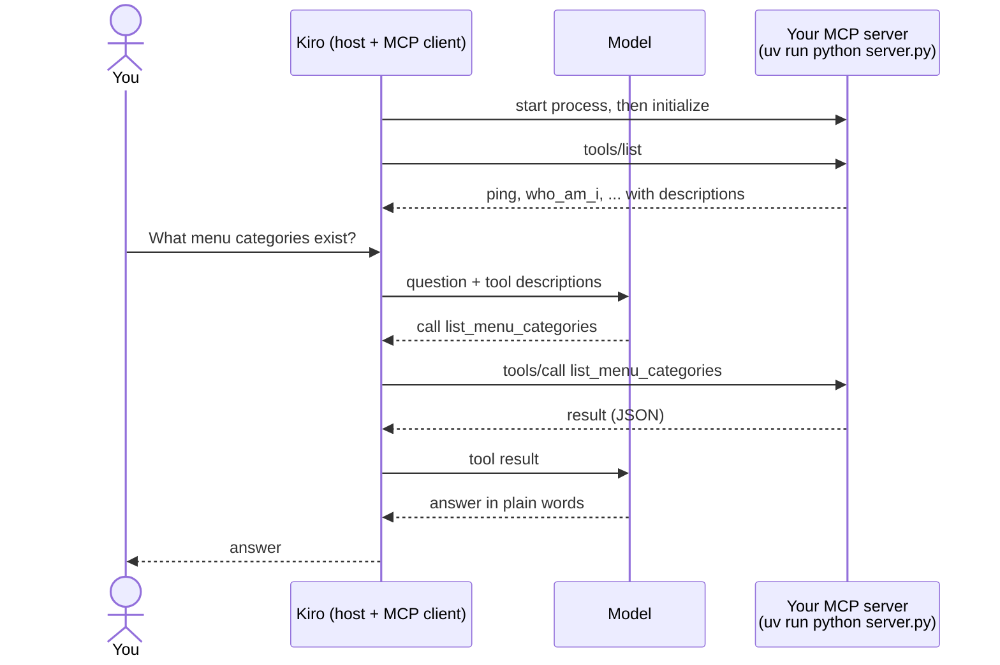

# D1 M01 — Hello MCP (40m)

## Objectives
- Run a local MCP server over stdio.
- Inspect and call tools with MCP Inspector.
- Register the server in Kiro and call it from chat.

## Pre-built (`mcp-server/`)
Official MCP Python SDK v2 (`MCPServer`, formerly `FastMCP` in v1).

```
mcp-server/
  app.py            creates the shared `mcp` server (auth wired from env)
  server.py         entry point: stdio by default, MCP_TRANSPORT=http for containers
  tools/hello.py    ping, who_am_i
  lib/redshift.py   run_query(sql, params)        - used in M02
  lib/validation.py date_range, bounded_int, ...  - used in M02
  lib/auth.py       JWT verification, current_caller() - used in M06
  tests/            pytest
```

## How a tool call travels

Kiro starts your server as a child process and talks to it over stdin/stdout (stdio). The model never sees your code, only the tool names, descriptions and parameters.



Open full size: [PNG](img/diagrams/01-hello-mcp-1.png) · [SVG](img/diagrams/01-hello-mcp-1.svg)

## Steps
1. `cd mcp-server && cp .env.example .env && uv sync` (PowerShell: `cd mcp-server; Copy-Item .env.example .env; uv sync`)
2. Read `app.py` and `tools/hello.py` together:

    ```python
    from app import mcp

    @mcp.tool()
    def ping(name: str) -> str:
        """Health check. Returns a greeting.

        Args:
            name: Who is saying hello, e.g. "Alex".
        """
        return f"Hello {name}, restaurant MCP is alive"
    ```

3. Run Inspector: `npx @modelcontextprotocol/inspector uv run python server.py`. Call `ping`. Then open the **Resources** tab and read `rst://data-dictionary`: that is a resource (context the client loads), not a tool (an action the model calls).

    > **Screenshot** — `<SCREENSHOT_YET_TO_PREPARE>` MCP Inspector connected over stdio, `ping` called, result shown · save as `img/m01-inspector-ping.png`

4. Ask Kiro to add `list_menu_categories` to `tools/hello.py` returning the 5 categories from `docs/data-dictionary.md`. Re-test in Inspector.
5. Copy `kiro/mcp.json.example` → `.kiro/settings/mcp.json`, keep `rst-local` only. In Kiro chat: "What menu categories exist?"

    > **Screenshot** — `<SCREENSHOT_YET_TO_PREPARE>` Kiro MCP panel with `rst-local` connected, and the chat calling `list_menu_categories` · save as `img/m01-kiro-mcp-panel.png`

6. Copy `kiro/steering/*.md` → `.kiro/steering/`.

## Checkpoint
Kiro chat calls `list_menu_categories` and shows the result.

## Discussion
- Docstring = what the model sees. Change it to something vague; does Kiro still pick it?
- Call `who_am_i`. Locally there is no login, so the role comes from `LOCAL_ROLE` in `.env`. Set `LOCAL_ROLE=manager` and `LOCAL_BRANCH_ID=12` and call again — preview of M06.
