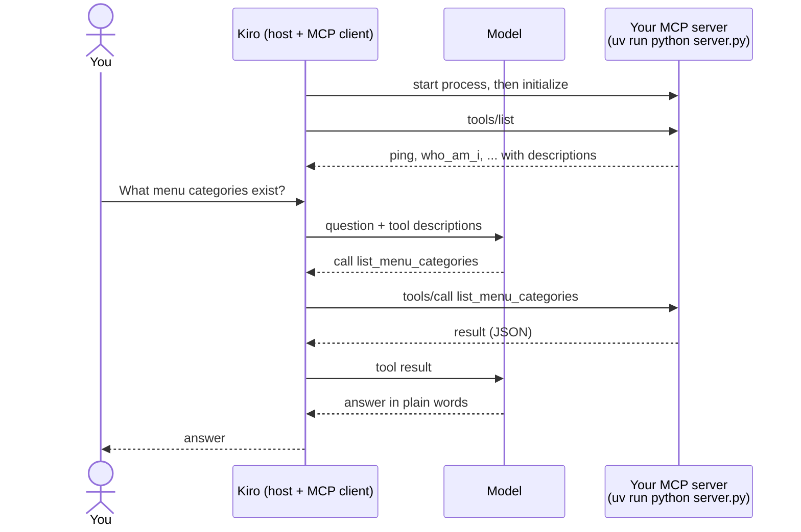

# D1 M01 — Hello MCP (40m)

## Objectives
- Run a local MCP server over stdio.
- Inspect and call tools with MCP Inspector.
- Register the server in Kiro and call it from chat.

## Pre-built (`mcp-server/`)
Official MCP Python SDK v2 (`MCPServer`, formerly `FastMCP` in v1).

```
mcp-server/
  app.py            creates the shared `mcp` server (auth wired from env)
  server.py         entry point: stdio by default, MCP_TRANSPORT=http for containers
  tools/hello.py    ping, who_am_i
  lib/redshift.py   run_query(sql, params)        - used in M02
  lib/validation.py date_range, bounded_int, ...  - used in M02
  lib/auth.py       JWT verification, current_caller() - used in M06
  tests/            pytest
```

## How a tool call travels

Kiro starts your server as a child process and talks to it over stdin/stdout (stdio). The model never sees your code, only the tool names, descriptions and parameters.



Open full size: [PNG](img/diagrams/01-hello-mcp-1.png) · [SVG](img/diagrams/01-hello-mcp-1.svg)

## Steps
0. **Open the workshop folder in Kiro**: File → Open Folder → `ktws/AWS-001-AgenticFromScratch` (not `mcp-server/`, and not the `ktws` repo root). Kiro's settings, steering rules and the server path in `mcp.json` are all relative to this folder. Open a terminal in Kiro (or any terminal) in the same folder.
1. Set up the starter server, then come back to the workshop folder:

    ```bash
    cd mcp-server && cp .env.example .env && uv sync && cd ..
    ```

    ```powershell
    cd mcp-server; Copy-Item .env.example .env; uv sync; cd ..
    ```

2. Read `mcp-server/app.py` and `mcp-server/tools/hello.py` together:

    ```python
    from app import mcp

    @mcp.tool()
    def ping(name: str) -> str:
        """Health check. Returns a greeting.

        Args:
            name: Who is saying hello, e.g. "Alex".
        """
        return f"Hello {name}, restaurant MCP is alive"
    ```

3. Run Inspector from the `mcp-server` folder: `cd mcp-server`, then `npx @modelcontextprotocol/inspector uv run python server.py`. It opens `http://127.0.0.1:6274` in your browser: choose **Connect**, then call `ping` on the **Tools** tab. Then open the **Resources** tab and read `rst://data-dictionary`: that is a resource (context the client loads), not a tool (an action the model calls). Stop Inspector with Ctrl+C and `cd ..` back to the workshop folder.

    > **Screenshot** — `<SCREENSHOT_YET_TO_PREPARE>` MCP Inspector connected over stdio, `ping` called, result shown · save as `img/m01-inspector-ping.png`

4. Give Kiro the workshop's rules and the server config. From the workshop folder:

    ```bash
    mkdir -p .kiro/steering .kiro/settings
    cp kiro/steering/*.md .kiro/steering/
    cp kiro/mcp.json.example .kiro/settings/mcp.json
    ```

    ```powershell
    New-Item -ItemType Directory -Force .kiro\steering, .kiro\settings | Out-Null
    Copy-Item kiro\steering\*.md .kiro\steering\
    Copy-Item kiro\mcp.json.example .kiro\settings\mcp.json
    ```

    The steering rules (SQL safety, tool design) now apply to everything Kiro writes. In `mcp.json` only `rst-local` is enabled; the other entries are for later modules and stay `"disabled": true`. In Kiro's MCP panel, `rst-local` should show as connected (choose retry if not).
5. In the **Kiro chat panel**, ask: *"Add a tool `list_menu_categories` to `mcp-server/tools/hello.py` that returns the 5 menu categories from `docs/data-dictionary.md`."* Review the change, then re-test it in Inspector (step 3).
6. Still in Kiro chat: *"What menu categories exist?"* Kiro should call `list_menu_categories` (you may need to reconnect `rst-local` in the MCP panel so it sees the new tool).

    > **Screenshot** — `<SCREENSHOT_YET_TO_PREPARE>` Kiro MCP panel with `rst-local` connected, and the chat calling `list_menu_categories` · save as `img/m01-kiro-mcp-panel.png`

## Checkpoint
Kiro chat calls `list_menu_categories` and shows the result.

## Discussion
- Docstring = what the model sees. Change it to something vague; does Kiro still pick it?
- Call `who_am_i`. Locally there is no login, so the role comes from `LOCAL_ROLE` in `.env`. Set `LOCAL_ROLE=manager` and `LOCAL_BRANCH_ID=12` and call again — preview of M06.
