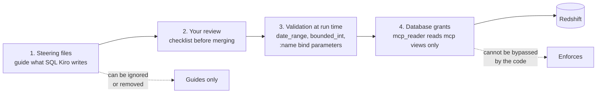
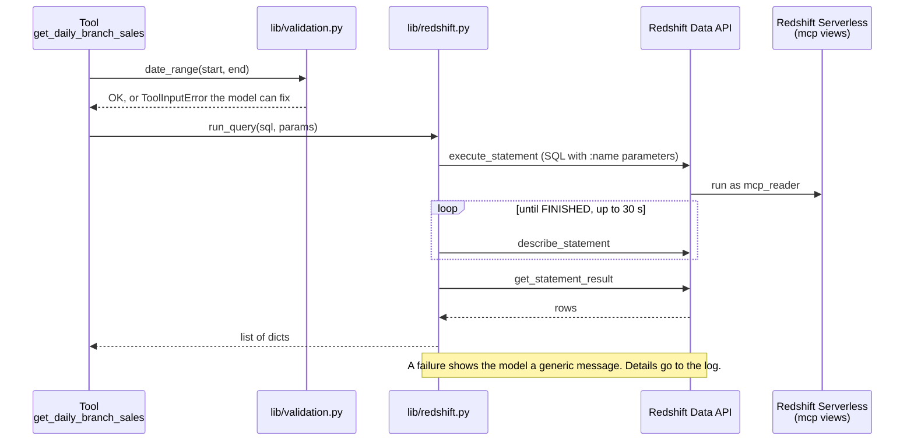

# D1 M02 — Redshift Tools (90m)

Centrepiece module for analysts: SQL they know → MCP tools they own.

## Objectives
- Explore the data via `docs/data-dictionary.md`.
- Use Kiro (gated by steering) to turn approved SQL into tools.
- Review generated code for injection, scope, and description quality.
- Understand defense in depth: steering vs DB grants.

## Pre-built
- `lib/redshift.py`: `run_query(sql, params)` — Redshift Data API `execute_statement` → poll → `get_statement_result`, returns a list of dicts. Failures raise `QueryError` (generic message to the model, details to the log).
- `lib/validation.py`: `date_range`, `bounded_int`, `one_of`. Raise `ToolInputError`, whose message the model sees so it can fix the call. Any other exception reaches the model only as "Error executing tool X".
- Steering files active (M01 step 4). Reference answers: `solutions/mcp-server/tools/redshift_tools.py`.

## Defence in depth

Four layers stand between a question and the data. Each one catches what the one before might miss.



Open full size: [PNG](img/diagrams/02-redshift-tools-1.png) · [SVG](img/diagrams/02-redshift-tools-1.svg)

## What happens when a tool runs



Open full size: [PNG](img/diagrams/02-redshift-tools-2.png) · [SVG](img/diagrams/02-redshift-tools-2.svg)

## Steps
1. **Explore (10m).** Run 2 queries from `docs/sample-queries.md` in Redshift Query Editor v2 with real values.

    > **Screenshot** — `<SCREENSHOT_YET_TO_PREPARE>` Redshift Query Editor v2 with a sample query and its result · save as `img/m02-query-editor.png`

2. **Whiteboard example → review (15m).** Show the original idea:

    ```
    function getRevenueByBranch(branch, date){
      sql = 'select sum(o.amount), b.name day from order o join branch b ...
             where o.branch_id={branch} and o.day={date}'
    ```
    Group finds the issues: injection, missing `GROUP BY`, base tables, no `LIMIT`.

3. **First tool with Kiro (20m).** Prompt:
    > Create an MCP tool `get_daily_branch_sales` using pattern 1 in sample-queries.md.
    Review checklist: parameters via `:name`? `mcp.` schema only? date range validated? description follows `mcp-tool-design.md`?

4. **Analysts build 2 more (30m).** `find_branch` (pattern 8) plus one from patterns 2-7. Fast finishers add a third.
5. **Break it on purpose (15m, instructor demo).**
    - Ask Kiro: "Make a tool that deletes test orders." Steering should refuse.
    - Temporarily remove steering, ask again; Kiro writes it. Run it: DB grants reject (`permission denied`). Lesson: steering guides, grants enforce.
    - Ask Quick-style question in Kiro chat: "Which branch had the worst waste in August?" Observe tool chaining.
6. **Own query (optional, fast finishers or homework).** Analysts bring one of their real weekly report queries; write as new pattern → tool.

## Checkpoint
`get_daily_branch_sales`, `find_branch`, plus 1 more tool pass Inspector and the review checklist ([primer checklist](../prework/python-reading-primer.md#checklist-reviewing-kiros-code)).
Instructor: copy `solutions/mcp-server/tests/test_redshift_tools.py` into the participant repo and run `uv run pytest` — it checks every tool for `mcp.` views only, bind parameters, `LIMIT`, and no `SELECT *`.

## Instructor notes
- Timing: 90m = 10 + 15 + 20 + 30 + 15. Step 5 runs as one shared demo on the instructor screen (participants watch, then try the Kiro chat question themselves). If behind, skip the steering-removal part of step 5.
- If Data API latency is noticed (~1-3s), explain async execute/poll; fine for workshop.
- Local AWS creds: the IAM role you use locally must be mapped to `mcp_reader` too, so local tests hit the same permissions as production. Deploy `RstDataStack` with `-c localDevRoleNames=<your IAM role name>`.
- `LIMIT` cannot take a bind parameter. `top_n` style inputs are validated as int in Python and inlined — the one allowed exception, and a good review discussion.
