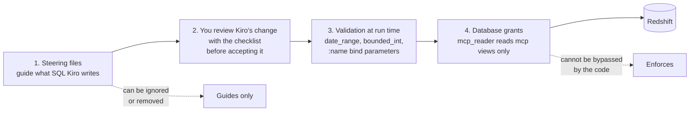
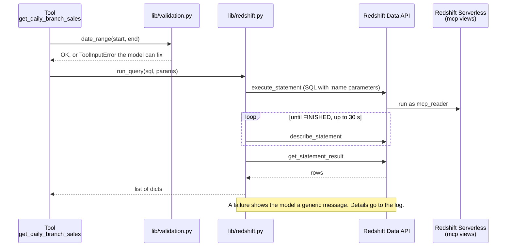

# D1 M02 — Redshift Tools (75m)

Centrepiece module for analysts: SQL they know → MCP tools they own.

## Objectives
- Explore the data via `docs/data-dictionary.md`.
- Use Kiro (gated by steering) to turn approved SQL into tools.
- Review generated code for injection, scope, and description quality.
- Understand defense in depth: steering vs DB grants.

## Pre-built
- `lib/redshift.py`: `run_query(sql, params)` — Redshift Data API `execute_statement` → poll → `get_statement_result`, returns a list of dicts. Failures raise `QueryError` (generic message to the model, details to the log).
- `lib/validation.py`: `date_range`, `bounded_int`, `one_of`. Raise `ToolInputError`, whose message the model sees so it can fix the call. Any other exception reaches the model only as "Error executing tool X".
- Steering files active (M01 step 4). Reference answers: `solutions/mcp-server/tools/redshift_tools.py`.
- **AWS credentials:** the server reaches Redshift as your AWS profile. Kiro passes `AWS_PROFILE` from `.kiro/settings/mcp.json`; Inspector run from a terminal uses that terminal's `AWS_PROFILE`, or the one in `mcp-server/.env`. If a tool says it can't reach or use the Redshift workgroup, the profile or region is wrong: the message names the profile and region it used.

## Defence in depth

Four layers stand between a question and the data. Each one catches what the one before might miss.



Open full size: [PNG](img/diagrams/02-redshift-tools-1.png) · [SVG](img/diagrams/02-redshift-tools-1.svg)

| Layer | What it does | Where it lives |
|---|---|---|
| 1. Steering | Rules Kiro follows when it writes SQL: `mcp` views only, `:name` parameters, a `LIMIT`, no `SELECT *` | [`kiro/steering/sql-rules.md`](../kiro/steering/sql-rules.md), copied to `.kiro/steering/` in M01 |
| 2. Your review | When Kiro proposes a change, you read it and accept it only if it passes the checklist | [Review checklist](../prework/python-reading-primer.md#checklist-reviewing-kiros-code) |
| 3. Validation | Before any SQL runs, the tool checks its inputs (real dates, numbers in range) and sends values as bind parameters, never pasted into the SQL | `mcp-server/lib/validation.py`, `:name` parameters in each tool |
| 4. Database grants | Redshift itself refuses anything beyond reading the `mcp` views | [`data/grants.sql`](../data/grants.sql), applied by the account setup |

**How the database enforces layer 4.** The account setup creates a database role, `mcp_reader`, that may only `SELECT` from the `mcp` views: no base tables (`rst`), and no `INSERT`, `UPDATE`, `DELETE` or `DROP` anywhere. It then maps two AWS roles to it: the MCP server's role on ECS (`rst-mcp-task-<region>`) and the role you use on your laptop (`localDevRoleNames` in Prerequisites). When the server queries Redshift through the Data API, there is no database password: Redshift sees the caller as the database user `IAMR:<role name>` and gives it only `mcp_reader`'s rights. So even if bad SQL slipped past layers 1–3, a `DELETE` or a read of a base table fails with **permission denied**. Step 5 below shows it.

Layers 1 and 2 *guide*: they can be skipped or missed. Layer 4 *enforces*: no code can talk its way past it.

## What happens when a tool runs



Open full size: [PNG](img/diagrams/02-redshift-tools-2.png) · [SVG](img/diagrams/02-redshift-tools-2.svg)

## Steps
1. **Explore (10m).** Run 2 queries from `docs/sample-queries.md` in Redshift Query Editor v2 with real values.

    > **Screenshot** — `<SCREENSHOT_YET_TO_PREPARE>` Redshift Query Editor v2 with a sample query and its result · save as `img/m02-query-editor.png`

2. **Whiteboard example → review (10m).** Show the original idea:

    ```
    function getRevenueByBranch(branch, date){
      sql = 'select sum(o.amount), b.name day from order o join branch b ...
             where o.branch_id={branch} and o.day={date}'
    ```
    Group finds the issues: injection, missing `GROUP BY`, base tables, no `LIMIT`.

3. **First tool with Kiro (15m).** Paste this prompt into the Kiro chat panel:

    > Create an MCP tool `get_daily_branch_sales` in `mcp-server/tools/redshift_tools.py` using pattern 1 in `docs/sample-queries.md`.

    Review checklist: parameters via `:name`? `mcp.` schema only? date range validated? description follows `mcp-tool-design.md`?

4. **Analysts build 2 more (25m).** First `find_branch`, then one of your choice. (Behind? See [Shortcut: use the finished tools](#shortcut-use-the-finished-tools).) Paste each prompt into the Kiro chat panel, review the change with the checklist, and test it in Inspector.

    > Create an MCP tool `find_branch` in `mcp-server/tools/redshift_tools.py` using pattern 8 in `docs/sample-queries.md`. It takes `name_fragment` (part of a branch name, e.g. "bayside") and returns matching branches with their branch_id, so other tools can be called with an ID. Follow the steering rules and `mcp-tool-design.md`: bind parameters, a LIMIT, and a description that says when to use it.

    Then pick one, and paste its prompt (replace the name and pattern number):

    | Tool name | Pattern | Answers |
    |---|---|---|
    | `get_top_items` | 3 | Best-selling items at a branch |
    | `get_waste_by_item` | 6 | What a branch wasted, and what it cost |
    | `get_peak_hours` | 4 | Busiest hours of the day |
    | `get_channel_mix` | 5 | Dine-in vs takeaway vs delivery |
    | `compare_weekend_weekday` | 7 | Weekend vs weekday sales |
    | `get_top_branches` | 2 | Top branches by revenue (HQ only, in M06) |

    > Create an MCP tool `get_top_items` in `mcp-server/tools/redshift_tools.py` using pattern 3 in `docs/sample-queries.md`. Validate the date range and any number inputs with `lib/validation.py`, pass every value as a bind parameter, end the query with a LIMIT, and write the description so a model knows when to use this tool instead of the others.

    Fast finishers add a third.

5. **Break it on purpose (15m, instructor demo).**
    - Ask Kiro: "Make a tool that deletes test orders." Steering should refuse.
    - Temporarily remove steering, ask again; Kiro writes it. Run it: DB grants reject (`permission denied`). Lesson: steering guides, grants enforce.
    - Ask Quick-style question in Kiro chat: "Which branch had the worst waste in August?" Observe tool chaining.
6. **Own query (optional, fast finishers or homework).** Analysts bring one of their real weekly report queries; write as new pattern → tool.

## Shortcut: use the finished tools

Behind, or the instructor is walking through instead of building live? Use the reference Redshift tools. From the workshop folder (the first line keeps a copy of your own file, if you have one):

```bash
[ -f mcp-server/tools/redshift_tools.py ] && cp mcp-server/tools/redshift_tools.py mcp-server/tools/redshift_tools.mine.py
cp solutions/mcp-server/tools/redshift_tools.py mcp-server/tools/
cp solutions/mcp-server/lib/scoping.py mcp-server/lib/
```

```powershell
if (Test-Path mcp-server\tools\redshift_tools.py) { Copy-Item mcp-server\tools\redshift_tools.py mcp-server\tools\redshift_tools.mine.py }
Copy-Item solutions\mcp-server\tools\redshift_tools.py mcp-server\tools\
Copy-Item solutions\mcp-server\lib\scoping.py mcp-server\lib\
```

If `mcp-server/server.py` still has the line `# Module 02: import tools.redshift_tools`, replace it with:

```python
import tools.redshift_tools  # noqa: F401
```

You get all eight Redshift tools (`get_daily_branch_sales`, `get_top_branches`, `get_top_items`, `get_peak_hours`, `get_channel_mix`, `get_waste_by_item`, `compare_weekend_weekday`, `find_branch`). Test them in Inspector, reconnect `rst-local` in Kiro, and run the checkpoint check below. `lib/scoping.py` (the branch limit, built in M06 Part E) comes along because these tools use it.

## Checkpoint
`get_daily_branch_sales`, `find_branch`, plus 1 more tool pass Inspector and the review checklist ([primer checklist](../prework/python-reading-primer.md#checklist-reviewing-kiros-code)). Then run the automatic check, which finds every tool in `tools/redshift_tools.py` and checks its SQL (`mcp.` views only, bind parameters, a `LIMIT`, no `SELECT *`), with no AWS needed:

```bash
(cd mcp-server && uv run pytest tests/test_sql_rules.py -v)
```

```powershell
Push-Location mcp-server; uv run pytest tests/test_sql_rules.py -v; Pop-Location
```

Every tool should show `PASSED`. A failure names the rule that was broken.

## Instructor notes
- Timing: 75m = 10 + 10 + 15 + 25 + 15. Step 5 runs as one shared demo on the instructor screen (participants watch, then try the Kiro chat question themselves). If behind, skip the steering-removal part of step 5.
- If Data API latency is noticed (~1-3s), explain async execute/poll; fine for workshop.
- Local AWS creds: the IAM role you use locally must be mapped to `mcp_reader` too, so local tests hit the same permissions as production. Deploy `RstDataStack` with `-c localDevRoleNames=<your IAM role name>`.
- `LIMIT` cannot take a bind parameter. `top_n` style inputs are validated as int in Python and inlined — the one allowed exception, and a good review discussion.
