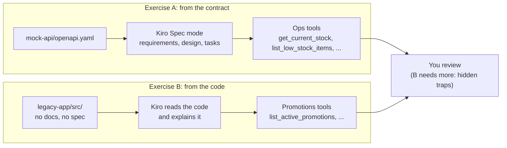
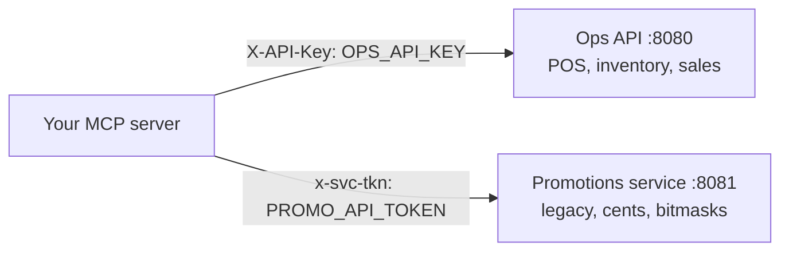

# D1 M03 — Wrap an Internal API (75m)

Simulates the restaurant chain's existing internal apps. Two ways Kiro can build the MCP layer.

## Objectives
- Generate MCP tools from an API contract (OpenAPI).
- Generate MCP tools from undocumented code.
- Decide which endpoints deserve tools and which should be combined or skipped.

## Pre-built
- `docker compose up -d` (from the workshop folder): mock Ops API on `:8080` (key `local-dev-key`), Promotions service on `:8081` (token `legacy-dev-token`). Without Docker: `cd mock-api && uv run uvicorn app.main:app --port 8080` and `cd legacy-app && npm start`, each in its own terminal (PowerShell: replace `&&` with `;`).
- **Using Finch instead of Docker?** Type `finch compose` wherever the guides say `docker compose`, e.g. `finch compose up -d`. Stop the services with `finch compose down`. Finch needs `mcp-server/.env` to exist (M01 step 1), even to stop them.
- `mock-api/openapi.yaml` — contract. Branch/item IDs match Redshift. Branch 12 is always low on chicken (demo).
- `legacy-app/src/` — undocumented Promotions service (Node, no spec, no README for participants).
- `.env`: `OPS_API_BASE_URL`, `OPS_API_KEY`, `PROMO_API_BASE_URL`, `PROMO_API_TOKEN`.
- Reference answers: `solutions/mcp-server/tools/ops_tools.py`, `promo_tools.py`.

## Two ways to build the tools



Open full size: [PNG](img/diagrams/03-wrap-internal-api-1.png) · [SVG](img/diagrams/03-wrap-internal-api-1.svg)

At run time the MCP server calls both services with their own credentials, which never reach the model:



Open full size: [PNG](img/diagrams/03-wrap-internal-api-2.png) · [SVG](img/diagrams/03-wrap-internal-api-2.svg)

## Exercise A — From contract (30m)

Short on time, or watching an instructor walk-through? Skip to [Shortcut: use the finished tools](#shortcut-use-the-finished-tools).

1. Open `mock-api/openapi.yaml`. Skim with participants: POS, Inventory, Sales.
2. Use Kiro **Spec** mode, and paste this prompt into the Kiro chat panel:

    > Using #[[file:mock-api/openapi.yaml]], design MCP tools for branch managers in `mcp-server/tools/ops_tools.py`. Don't map 1:1. Read-only first. Read the base URL and API key from the environment variables OPS_API_BASE_URL and OPS_API_KEY.

    The tools run inside the MCP server, so it is the **MCP server** that needs the Ops API's address and key. Both are already set: in `mcp-server/.env` (for Inspector) and in `.kiro/settings/mcp.json` (for Kiro), as `http://localhost:8080` and `local-dev-key`, which matches the mock API's own key in `docker-compose.yml`. Reading them from variables, instead of writing them into the code, is what lets the same tools use the real addresses and keys on ECS in M05.

3. Review Kiro's `requirements.md` / `design.md` before letting it generate tasks. Push back on any 1:1 mapping.
4. Implement. Expected tools: `get_current_stock`, `list_low_stock_items`, `get_today_sales`, `list_orders_today`, `get_order`.

## Exercise B — From code (30m)
1. Open `legacy-app/`. No docs, no spec.
2. Paste this prompt into the Kiro chat panel:

    > Read legacy-app/ and explain what the Promotions endpoints do. Then create read-only MCP tools for them in `mcp-server/tools/promo_tools.py`. Read the service's base URL and token from the environment variables PROMO_API_BASE_URL and PROMO_API_TOKEN.

    As in Exercise A, both variables are already set for the MCP server (`mcp-server/.env` and `.kiro/settings/mcp.json`). How the token is sent, and everything else, Kiro has to work out from the code.

3. Compare with Exercise A: accuracy, hallucinated fields, missed auth headers.

The legacy code hides several traps. Did Kiro find them? Check its tools first, then open the list.

<details>
<summary>Hidden traps (open after the exercise)</summary>

- Money is in **cents** (integers), not dollars.
- Channels are a **bitmask** (`1` dine-in, `2` takeaway, `4` drive-thru, `8` delivery).
- Dates are `yyyymmdd` integers; `hr` restricts promos to hours (`"11-14"`).
- Auth header is `x-svc-tkn`; errors use `rc` codes (`E01`-`E04`) and reason codes (`BR`, `DT`, `CH`, `MN`, `BQ`).
- Suspended promos (`st: 'S'`) are hidden; `url.parse()` is deprecated (code-review talking point).

</details>

## Shortcut: use the finished tools

Short on time, behind, or the instructor is walking through instead of building live? Use the reference tools instead of Exercises A and B. From the workshop folder:

```bash
cp solutions/mcp-server/tools/ops_tools.py solutions/mcp-server/tools/promo_tools.py mcp-server/tools/
cp solutions/mcp-server/lib/scoping.py mcp-server/lib/
```

```powershell
Copy-Item solutions\mcp-server\tools\ops_tools.py, solutions\mcp-server\tools\promo_tools.py mcp-server\tools\
Copy-Item solutions\mcp-server\lib\scoping.py mcp-server\lib\
```

Then open `mcp-server/server.py` and replace the line `# Module 03: import tools.ops_tools, tools.promo_tools` with:

```python
import tools.ops_tools  # noqa: F401
import tools.promo_tools  # noqa: F401
```

Test in Inspector (M01 step 3): you should see `get_current_stock`, `list_low_stock_items`, `get_today_sales`, `list_orders_today`, `get_order` and the four promotion tools. In Kiro, reconnect `rst-local`.

- `lib/scoping.py` (the branch limit) comes along because the finished tools use it. Participants normally build it in M06 Part E; with the shortcut you review it there instead.
- Walk through the files in this order: `ops_tools.py` (one tool per question, the `_get` helper, error messages the model can read), then `promo_tools.py` (how the hidden traps below are handled: cents, the channel bitmask, `yyyymmdd` dates).

## Wrap (15m)
- Contract-first more reliable; code-reading works but needs more review.
- Tool design: 8 endpoints became ~5 tools. Why? Discuss first, then open the answer.

    <details>
    <summary>Answer</summary>

    Tools should match the questions people ask, not the shape of the API. The 8 read-only Ops API endpoints became 5 tools in the reference solution:

    | API endpoints | Tool | Why |
    |---|---|---|
    | `GET /inventory/{branch}/stock` and `GET /inventory/{branch}/stock/{item}` | `get_current_stock` (optional `item_id`) | **Merged:** same question ("how much do I have?"), one optional parameter instead of two tools |
    | the same stock endpoint, filtered | `list_low_stock_items` | **Added:** "what am I low on?" is what managers ask; without it the model must fetch everything and compare with par levels itself |
    | `GET /sales/{branch}/today` | `get_today_sales` | Kept |
    | `GET /pos/{branch}/orders` | `list_orders_today` | Kept, named for what it covers (today only) |
    | `GET /pos/{branch}/orders/{order}` | `get_order` | Kept |
    | `GET /branches`, `GET /branches/{branch}` | none | **Skipped:** the Redshift tool `find_branch` already turns a name into an ID |
    | `GET /menu/items` | none | **Skipped:** a short, fixed list that is in the data dictionary |

    Why fewer, task-shaped tools are better:

    - **The model has to choose.** Every tool's name and description goes into its context: many near-duplicates mean more wrong picks and more tokens on every question.
    - **One clear tool per question** gives simpler descriptions, so the model picks right more often (Day 3 measures exactly this).
    - **No two tools answer the same thing**, such as `find_branch` and `GET /branches`.

    </details>
- Write endpoints (`issueRefund`, `requestStockTransfer`) held back until auth exists → revisited Day 2 M05.

## Checkpoint
In Kiro chat: "Branch 12 is low on chicken right now. How much chicken did it waste last month?" Answer uses one API tool + one Redshift tool.
