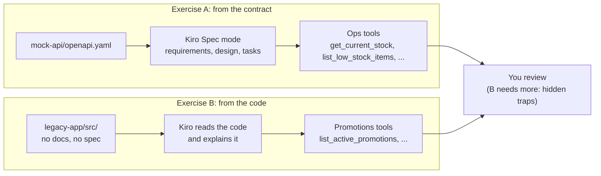
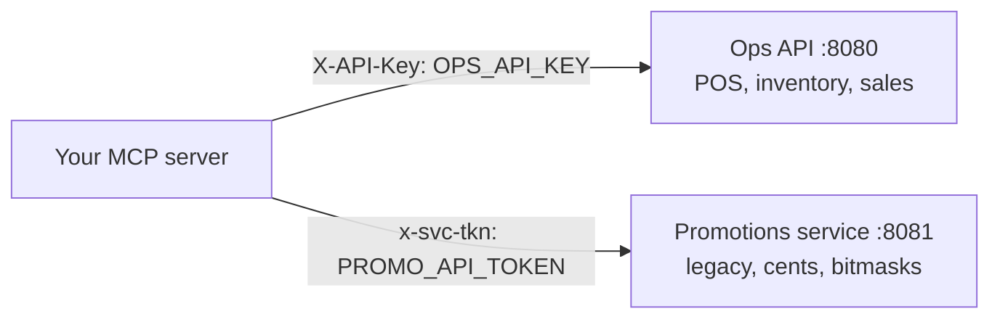

# D1 M03 — Wrap an Internal API (75m)

Simulates the restaurant chain's existing internal apps. Two ways Kiro can build the MCP layer.

## Objectives
- Generate MCP tools from an API contract (OpenAPI).
- Generate MCP tools from undocumented code.
- Decide which endpoints deserve tools and which should be combined or skipped.

## Pre-built
- `docker compose up -d` (repo root): mock Ops API on `:8080` (key `local-dev-key`), Promotions service on `:8081` (token `legacy-dev-token`). Without Docker: `cd mock-api && uv run uvicorn app.main:app --port 8080` and `cd legacy-app && npm start`, each in its own terminal (PowerShell: replace `&&` with `;`).
- `mock-api/openapi.yaml` — contract. Branch/item IDs match Redshift. Branch 12 is always low on chicken (demo).
- `legacy-app/src/` — undocumented Promotions service (Node, no spec, no README for participants).
- `.env`: `OPS_API_BASE_URL`, `OPS_API_KEY`, `PROMO_API_BASE_URL`, `PROMO_API_TOKEN`.
- Reference answers: `solutions/mcp-server/tools/ops_tools.py`, `promo_tools.py`.

## Two ways to build the tools

Open full size: [PNG](img/diagrams/03-wrap-internal-api-1.png) · [SVG](img/diagrams/03-wrap-internal-api-1.svg)

At run time the MCP server calls both services with their own credentials, which never reach the model:

Open full size: [PNG](img/diagrams/03-wrap-internal-api-2.png) · [SVG](img/diagrams/03-wrap-internal-api-2.svg)

## Exercise A — From contract (30m)
1. Open `mock-api/openapi.yaml`. Skim with participants: POS, Inventory, Sales.
2. Use Kiro **Spec** mode:
    > Using #[[file:mock-api/openapi.yaml]], design MCP tools for branch managers. Don't map 1:1. Read-only first. Base URL and API key from env vars OPS_API_BASE_URL and OPS_API_KEY.

3. Review Kiro's `requirements.md` / `design.md` before letting it generate tasks. Push back on any 1:1 mapping.
4. Implement. Expected tools: `get_current_stock`, `list_low_stock_items`, `get_today_sales`, `list_orders_today`, `get_order`.

## Exercise B — From code (30m)
1. Open `legacy-app/`. No docs, no spec.
2. Prompt:
    > Read legacy-app/ and explain what the Promotions endpoints do. Then create read-only MCP tools for them.

3. Compare with Exercise A: accuracy, hallucinated fields, missed auth headers.

Hidden traps in the legacy code (instructor only) — did Kiro find them?

- Money is in **cents** (integers), not dollars.
- Channels are a **bitmask** (`1` dine-in, `2` takeaway, `4` drive-thru, `8` delivery).
- Dates are `yyyymmdd` integers; `hr` restricts promos to hours (`"11-14"`).
- Auth header is `x-svc-tkn`; errors use `rc` codes (`E01`-`E04`) and reason codes (`BR`, `DT`, `CH`, `MN`, `BQ`).
- Suspended promos (`st: 'S'`) are hidden; `url.parse()` is deprecated (code-review talking point).

## Wrap (15m)
- Contract-first more reliable; code-reading works but needs more review.
- Tool design: 8 endpoints became ~5 tools. Why?
- Write endpoints (`issueRefund`, `requestStockTransfer`) held back until auth exists → revisited Day 2 M05.

## Checkpoint
In Kiro chat: "Branch 12 is low on chicken right now. How much chicken did it waste last month?" Answer uses one API tool + one Redshift tool.
