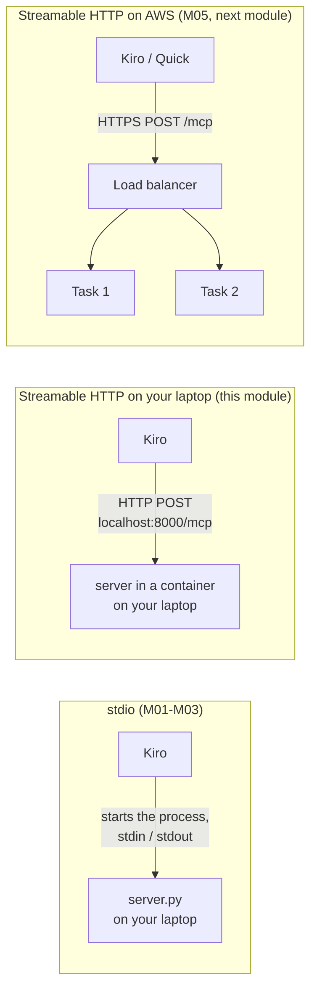

# D1 M04 — Go Remote (30m)

## Objectives
- Switch transport from stdio to Streamable HTTP.
- Understand why stateless mode matters behind a load balancer.
- Run the server in a container locally.

## Steps
1. Read `main()` in `server.py` — already supports both transports:

    ```python
    mcp.run(
        "streamable-http",
        host="0.0.0.0",
        port=int(os.environ.get("PORT", "8000")),
        stateless_http=True,
        json_response=True,
    )
    ```
    and a `/health` route for the load balancer.

2. Run over HTTP, from the `mcp-server` folder, and leave this terminal running: `MCP_TRANSPORT=http uv run python server.py` (PowerShell: `$env:MCP_TRANSPORT = "http"; uv run python server.py`, then `Remove-Item Env:MCP_TRANSPORT` to go back to stdio). The log ends with `Uvicorn running on http://0.0.0.0:8000`.

    Quick check in a browser: `http://localhost:8000/health` shows `{"status":"ok"}`. Opening `http://localhost:8000/mcp` in a browser is not a real test, because a browser is not an MCP client. Depending on the browser you see either a stream of `: ping - <time>` lines, one every 15 seconds (the server keeping a connection open for messages it might push), or `Not Acceptable: Client must accept text/event-stream`. Both are **normal**: the server is up.

3. Test with a real MCP client. In a **second** terminal (the server keeps running in the first), point Inspector at the server's URL:

    ```bash
    npx @modelcontextprotocol/inspector --server-url http://localhost:8000/mcp --transport http
    ```

    ```powershell
    npx @modelcontextprotocol/inspector --server-url http://localhost:8000/mcp --transport http
    ```

    It opens the Inspector page connected to your server: your tools appear on the Tools tab and calls work as in M01. Started without `--server-url`, Inspector shows its own sample servers instead (`filesystem-server-default`, `everything-server-default`, `example-server-default`); you can ignore those.

    > **Screenshot** — `<SCREENSHOT_YET_TO_PREPARE>` MCP Inspector with transport Streamable HTTP and URL `http://localhost:8000/mcp` · save as `img/m04-inspector-http.png`

4. Container (needs Docker or Finch), from the workshop folder:

    ```bash
    docker compose --profile http up --build
    ```

    ```powershell
    docker compose --profile http up --build
    ```
    Starts mock-api, legacy-app and the MCP server on `:8000`. With Finch, use `finch compose --profile http up --build`.

    To stop everything: `docker compose --profile http down` (with Finch: `finch compose --profile http down`, then `finch compose down`, because Finch leaves the other services running otherwise).

5. Point Kiro at `http://localhost:8000/mcp` (no auth yet).

## stdio vs Streamable HTTP



Open full size: [PNG](img/diagrams/04-go-remote-1.png) · [SVG](img/diagrams/04-go-remote-1.svg)

Nothing is deployed to AWS in this module: you run the HTTP version on your laptop. The AWS part is what M05 builds, and it is why the server must be **stateless**: the load balancer may send each request to a different task. With `stateless_http=True` no task keeps session state, so any task can answer any request and no sticky sessions are needed.

## Key concepts
- **Stateless:** each request independent → any ECS task can serve it, no sticky sessions. AgentCore Runtime (Day 2) also expects this.
- **JSON responses:** no long-lived SSE streams, which keeps ALB and CloudFront simple.
- **No auth yet:** anyone who can reach port 8000 can query Redshift. Fixed in M06.

## Checkpoint
HTTP server answers tool calls from Inspector and Kiro.
