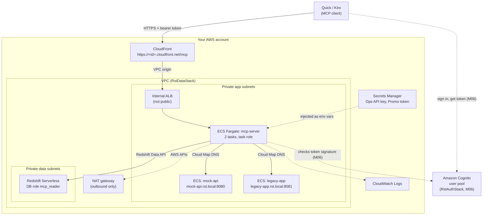

# D1 M05 — Deploy to ECS (30m)

## Objectives
- Deploy MCP server to ECS Fargate with pre-built CDK.
- Understand each component and why it is there.

## Pre-built (`infra/`)
`RstDataStack` and `RstAuthStack` are already deployed in your account. You deploy `RstMcpStack`.

## Architecture diagram



Open full size: [PNG](img/diagrams/05-deploy-ecs-1.png) · [SVG](img/diagrams/05-deploy-ecs-1.svg)

| Box | What it is | Why it's there | What if it were missing |
|---|---|---|---|
| CloudFront | HTTPS front door with a `*.cloudfront.net` certificate | Quick only connects to HTTPS. No custom domain or certificate needed | You would need a domain and an ACM certificate, or tokens would travel over plain HTTP |
| Internal ALB | Load balancer inside the VPC | Spreads requests over the 2 MCP server tasks; only CloudFront can reach it | Exposing tasks directly would put them on the internet |
| ECS Fargate: mcp-server | Your MCP server container, 2 tasks | Runs without servers to manage; 2 tasks survive one failing | A single task means downtime on every deploy or crash |
| Task role | IAM role the containers run as | No AWS keys in code or env vars; maps to the read-only `mcp_reader` database role | Someone would paste access keys into config |
| mock-api, legacy-app | The internal Ops API and Promotions service, found by name through Cloud Map | Stand-ins for internal systems the MCP server wraps (M03) | The API tools would have nothing to call |
| Redshift Serverless | The data warehouse, in isolated subnets | History for the Redshift tools (M02); `mcp_reader` can only read the `mcp` views | — |
| Secrets Manager | Stores the Ops API key and Promo token | ECS injects them at start-up, so they never sit in code | Secrets end up in the image or the repo |
| NAT gateway | Outbound-only internet path for private subnets | Lets tasks reach AWS APIs (Redshift Data API, Secrets Manager, logs) | Tasks can't call AWS services without VPC endpoints |
| CloudWatch Logs | Container logs | Where you debug tool calls and sign-in errors | You are blind when something fails |
| Cognito (M06) | Issues and signs user and service tokens | The server checks every token, then uses role and branch claims to limit data | Anyone with the URL can call the tools (the state right after this module) |

## Steps
1. **Start the deploy first** (it takes about 15 minutes, most of it CloudFront). Needs Docker or Finch to build images; with Finch set `CDK_DOCKER=finch`. Set the profile and region explicitly in this terminal: without them the deploy uses your default credentials, and a stale `AWS_REGION` overrides the profile's region, both sending the deploy to the wrong place. Use your own profile name if it isn't `workshop`, and check the account with `aws sts get-caller-identity` before deploying.

    ```bash
    export AWS_PROFILE=workshop AWS_REGION=<workshop region> CDK_DEFAULT_REGION=<workshop region>
    aws sts get-caller-identity                                          # the account you are about to deploy into
    export CDK_DOCKER=finch                                              # only if you use Finch
    cd infra && npm install
    npx cdk deploy RstMcpStack                                           # your server from ../mcp-server
    npx cdk deploy RstMcpStack -c mcpServerDir=../solutions/mcp-server   # catch-up: reference solution
    ```

    ```powershell
    $env:AWS_PROFILE = "workshop"; $env:AWS_REGION = "<workshop region>"; $env:CDK_DEFAULT_REGION = "<workshop region>"
    aws sts get-caller-identity                                          # the account you are about to deploy into
    $env:CDK_DOCKER = "finch"                                            # only if you use Finch
    cd infra; npm install
    npx cdk deploy RstMcpStack                                           # your server from ../mcp-server
    npx cdk deploy RstMcpStack -c mcpServerDir=../solutions/mcp-server   # catch-up: reference solution
    ```

    **Shared account?** If your instructor gave you a participant name (for example `alice`), use your own stack name and pass the name, so you don't overwrite anyone else's server. `--exclusively` deploys only your stack, not the shared data stack it builds on:

    ```bash
    npx cdk deploy RstMcpStack-<name> --exclusively -c participant=<name>
    npx cdk deploy RstMcpStack-<name> --exclusively -c participant=<name> -c mcpServerDir=../solutions/mcp-server   # catch-up
    ```

    ```powershell
    npx cdk deploy RstMcpStack-<name> --exclusively -c participant=<name>
    npx cdk deploy RstMcpStack-<name> --exclusively -c participant=<name> -c mcpServerDir=../solutions/mcp-server   # catch-up
    ```

    Use the **same** participant name on every later deploy (Module 06 too), and wherever the guides say `RstMcpStack`, read `RstMcpStack-<name>`.

2. While it deploys, walk through the [architecture diagram](#architecture-diagram) (5m, while the deploy runs). For each box: what, why, what if missing (see the table under the diagram).
3. **Still waiting: tour the console (10m).** The ECS services come up before CloudFront finishes, so look at them first. Same region as your deploy:

    | Where (AWS console) | What to look at | The point to make |
    |---|---|---|
    | **CloudFormation** → `RstMcpStack` → **Events** | Resources being created, in order | Infrastructure as code: everything below comes from `infra/lib/mcp-stack.ts`, and is deleted with it |
    | **ECS** → Clusters → the `RstMcpStack-Cluster…` cluster → **Services** | `mcp-server` (2 tasks), `mock-api`, `legacy-app` (1 each); a service's **Deployments** and **Tasks** tabs | Two copies of your server: one can fail or be replaced during a deploy without downtime. ECS restarts failed tasks by itself |
    | ECS → a task → **Configuration** | Environment variables (`REDSHIFT_WORKGROUP`, `OPS_API_BASE_URL=http://mock-api.rst.local:8080`), and the two secrets listed as **from Secrets Manager** | Settings come from the stack, not from `.env`; secret values never appear in the task definition |
    | **CloudWatch** → Log groups → `RstMcpStack-mcpserverLogs…` | The server's startup lines; after step 4, every tool call | Where you debug in M06: sign-in errors and tool failures show up here |
    | **IAM** → Roles → `rst-mcp-task-<region>` | Its two policy statements: run and read Redshift Data API statements on the workshop workgroup only; and the tag `RedshiftDbRoles = mcp_reader` | No AWS keys anywhere: the containers *are* this role, and Redshift turns it into the read-only `mcp_reader` (M02 defence layer 4) |
    | **Secrets Manager** | `OpsApiKey…` and `PromoApiToken…` | Generated by the stack, injected into the containers at start-up; nobody types or copies them |
    | **EC2** → Load balancers | One **internal** load balancer (scheme: internal) | Not reachable from the internet; only CloudFront reaches it, through the VPC origin |
    | **CloudFront** → Distributions | Your distribution, status *Deploying* (this is the slow part) | Gives HTTPS on `*.cloudfront.net` without a domain or certificate |

    > **Screenshot** — `<SCREENSHOT_YET_TO_PREPARE>` ECS console: the cluster with mcp-server, mock-api and legacy-app services running · save as `img/m05-ecs-services.png`

4. **Test it.** When the deploy finishes, it prints the outputs, including `RstMcpStack.McpUrl`. Read it into a variable (shared account: use `RstMcpStack-<name>`), then open Inspector on it:

    ```bash
    MCP_URL=$(aws cloudformation describe-stacks --stack-name RstMcpStack \
      --query "Stacks[0].Outputs[?OutputKey=='McpUrl'].OutputValue" --output text)
    echo $MCP_URL                      # https://<id>.cloudfront.net/mcp
    npx @modelcontextprotocol/inspector --server-url $MCP_URL --transport http
    ```

    ```powershell
    $McpUrl = (aws cloudformation describe-stacks --stack-name RstMcpStack `
      --query "Stacks[0].Outputs[?OutputKey=='McpUrl'].OutputValue" --output text)
    $McpUrl                            # https://<id>.cloudfront.net/mcp
    npx @modelcontextprotocol/inspector --server-url $McpUrl --transport http
    ```

    Expected: the Tools tab lists your tools and calls work, exactly as locally, but now through CloudFront and the load balancer to ECS. Call one and check it appears in the CloudWatch log group from step 3. **Note the `McpUrl` value**: M06 uses it as the OAuth resource identifier.

    > **Screenshot** — `<SCREENSHOT_YET_TO_PREPARE>` CloudFormation `RstMcpStack` Outputs tab with `McpUrl` · save as `img/m05-stack-outputs.png`

## Key concepts
- **HTTPS without a domain.** CloudFront gives a `*.cloudfront.net` certificate. Quick only connects to HTTPS endpoints; tokens must never travel over plain HTTP.
- **ALB is internal.** Only CloudFront (via VPC origin) can reach it.
- **Task role, not keys.** No AWS credentials in code or env vars. The role is mapped to the read-only `mcp_reader` database role.
- **Secrets Manager** holds the Ops API key and Promo token; ECS injects them as env vars.

## Checkpoint
Remote endpoint answers in Inspector. **Keep this stack**: M06 adds sign-in to it, and M07 and M08 use it.

It is **public and unauthenticated** right now (the `McpPublicUrlNote` output says so), so go on to M06 straight away. Only if you have to **stop before M06** (end of the day, a long break), delete it so nobody can query your data meanwhile, then redeploy when you come back:

- Delete: `npx cdk destroy RstMcpStack` (shared account: `npx cdk destroy RstMcpStack-<name> -c participant=<name>`; never `--all`, which would delete the shared data too).
- Coming back: redeploy (step 1, about 16 minutes). You get a **new** `McpUrl`, so use the new one in M06.

## Instructor notes
- Timing: 30m = start the deploy 5 + diagram 5 + console tour 10 + test 10. The deploy itself (about 16 minutes) runs underneath the diagram and the tour.
- Measured deploy time: about 16 minutes for a first deploy (images, ECS, CloudFront). Redeploys that only change settings take 3–4 minutes. Start the deploy before the walkthrough, or the module overruns: in 30 minutes the walkthrough and the console tour happen while CloudFront deploys.
- The first Redshift query after the workgroup has been idle can fail with "Internal error encountered". The reference server retries that error once (`lib/redshift.py`); if a participant's own server shows it, ask again.
