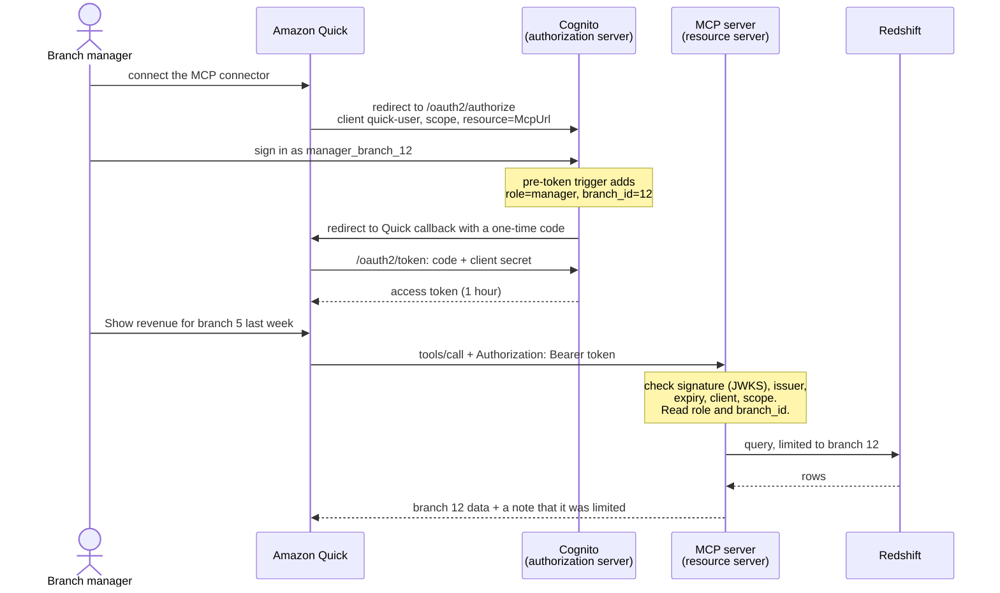
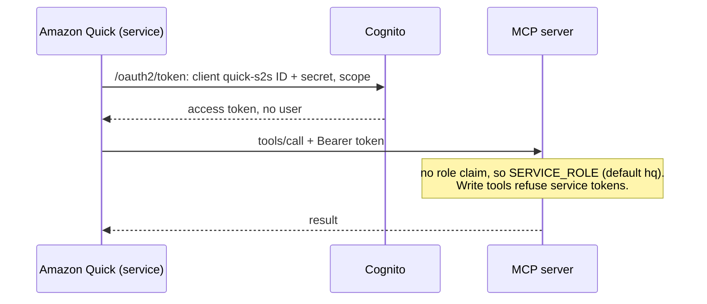
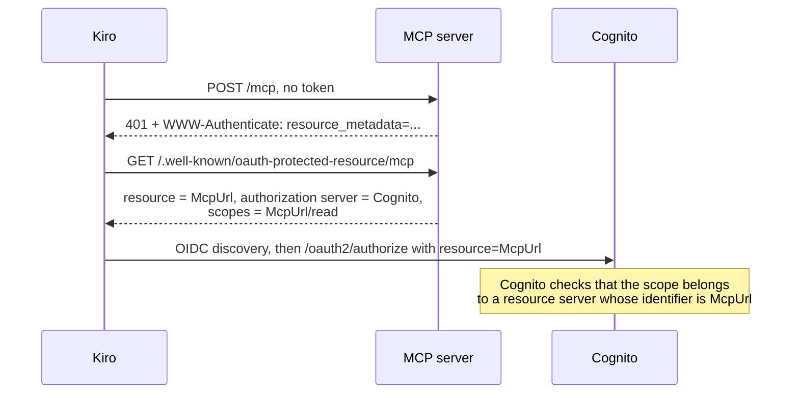

# D1 M06 — Authentication (90m)

Reference: [docs/auth-options.md](../docs/auth-options.md)

## Objectives
- Explain resource server vs authorization server, 2LO vs 3LO.
- Build Cognito user auth step by step.
- Connect Quick with service auth and user auth.
- Connect Kiro with OAuth sign-in (or a bearer token as fallback).
- Use token claims to scope data per user.

## Pre-built
- `mcp-server/lib/auth.py`: `JwtTokenVerifier` plugged into the SDK's built-in auth. Validates signature (JWKS), `iss`, `exp`, `token_use=access`, `client_id`/`aud`, scope.
- SDK serves Protected Resource Metadata at `/.well-known/oauth-protected-resource/mcp` and returns `401` + `WWW-Authenticate` when the token is missing; `403` when scope is missing.
- `current_caller()` → `role` and `branch_id` from token claims.
- Cognito user pool (`RstAuthStack`) with custom attributes `custom:role`, `custom:branch_id`, and a pre-token-generation trigger that copies them into the **access token** as `role` and `branch_id`.
- Test users (`scripts/create_test_users.py`): `analyst_hq`, `manager_branch_12`, `staff_branch_12`, `manager_branch_5`.
- `scripts/get_token.py`: browser sign-in (auth code + PKCE, always shows the login page) or client credentials; prints the access token. `scripts/get_test_tokens.py` signs in several test users in a row and checks each token belongs to the right user.

## Part A — Concepts (15m)
Walk through the two flows below: 3LO (a person signs in) first, then 2LO (no person, just the app).

**3LO: user sign-in (authorization code grant).** Quick shown; Kiro is the same, with a localhost redirect and no client secret (PKCE instead).



Open full size: [PNG](img/diagrams/06-auth-1.png) · [SVG](img/diagrams/06-auth-1.svg)

**2LO: service-to-service (client credentials).** No person signs in, so the token has no user claims; the server treats it as `SERVICE_ROLE`.



Open full size: [PNG](img/diagrams/06-auth-2.png) · [SVG](img/diagrams/06-auth-2.svg)

**How a client finds where to sign in.** Kiro discovers everything from the server's first `401`:



Open full size: [PNG](img/diagrams/06-auth-3.png) · [SVG](img/diagrams/06-auth-3.svg)

**Resource binding (RFC 8707).** MCP clients such as Kiro and Quick send `resource=<McpUrl>` when they ask for a token. Cognito then only accepts custom scopes that belong to a resource server **whose identifier is exactly that URL**. So the resource server identifier is your `McpUrl` (from M05), and the read scope is `<McpUrl>/read`, for example `https://d123abc.cloudfront.net/mcp/read`. That scope is a **name**, not a web page: Cognito names every scope `<resource server identifier>/<scope>`, so it only looks like a URL. Opening it in a browser shows *Not Found*, which is expected; you only type it into settings (app clients, the deploy command, Kiro).

## Part B — Build user auth in Cognito (25m, console, step by step)

> **Shared account?** Everyone uses one user pool, and a user pool has only one sign-in domain. So:
>
> - **Skip step 1.** The instructor has created the domain; use the `CognitoDomain` they give you.
> - **Put your participant name in everything you create**, so names don't clash: resource server `rst-mcp-<name>` (identifier = **your** `McpUrl`), app clients `quick-user-<name>`, `quick-s2s-<name>` and `kiro-user-<name>`, and a managed login style for each of your user-facing clients. Read those names wherever the steps below and Parts C–D say `rst-mcp`, `quick-user`, `quick-s2s` or `kiro-user`.
> - **The test users are shared**: everyone signs in as `manager_branch_12`, `analyst_hq` and so on.
> - **Step 7:** use the shared-account deploy command shown there.

1. Domain (managed login).

    > **Screenshot** — `<SCREENSHOT_YET_TO_PREPARE>` Cognito console: domain settings with managed login selected · save as `img/m06-cognito-domain.png`

2. Resource server: name `rst-mcp` (the name cannot contain `:` or `/`), **identifier = your `McpUrl`**, scope `read`. The full scope is `<McpUrl>/read`.

    > **Screenshot** — `<SCREENSHOT_YET_TO_PREPARE>` Cognito console: resource server with identifier = `McpUrl` and scope `read` · save as `img/m06-resource-server.png`

3. App client `quick-user`: confidential, auth code grant, scopes `openid <McpUrl>/read`. Callback URL: Quick's redirect URL, `https://<region>.quicksight.aws.amazon.com/sn/oauthcallback` (Quick pre-fills it in Part C; check it matches).

    > **Screenshot** — `<SCREENSHOT_YET_TO_PREPARE>` Cognito console: `quick-user` app client, login pages settings (grant type, scopes, callback URL) · save as `img/m06-app-client-quick-user.png`

4. App client `quick-s2s`: confidential, client credentials, scope `<McpUrl>/read`.
5. App client `kiro-user`: public (no secret), auth code grant, scopes `openid <McpUrl>/read`, callbacks `http://localhost:7778/oauth/callback` (Kiro) and `http://localhost:8765/callback` (`get_token.py`).
6. **Managed login style for each client that signs users in** (`quick-user`, `kiro-user`): Managed login → Create style (Cognito defaults are fine). Without a style the login page shows "Login pages unavailable".

    > **Screenshot** — `<SCREENSHOT_YET_TO_PREPARE>` Cognito console: Managed login, style created for `kiro-user` · save as `img/m06-managed-login-style.png`

7. Redeploy with auth on:

    ```bash
    npx cdk deploy RstMcpStack \
      -c oidcIssuer=https://cognito-idp.<region>.amazonaws.com/<user_pool_id> \
      -c oidcAllowedAudiences=<quick-user id>,<quick-s2s id>,<kiro-user id> \
      -c oidcRequiredScopes=<McpUrl>/read
    ```

    ```powershell
    npx cdk deploy RstMcpStack `
      -c oidcIssuer=https://cognito-idp.<region>.amazonaws.com/<user_pool_id> `
      -c oidcAllowedAudiences=<quick-user id>,<quick-s2s id>,<kiro-user id> `
      -c oidcRequiredScopes=<McpUrl>/read
    ```

    Shared account: deploy your own stack, with your participant name and your three client IDs:

    ```bash
    npx cdk deploy RstMcpStack-<name> --exclusively -c participant=<name> \
      -c oidcIssuer=https://cognito-idp.<region>.amazonaws.com/<user_pool_id> \
      -c oidcAllowedAudiences=<quick-user-<name> id>,<quick-s2s-<name> id>,<kiro-user-<name> id> \
      -c oidcRequiredScopes=<McpUrl>/read
    ```

    ```powershell
    npx cdk deploy RstMcpStack-<name> --exclusively -c participant=<name> `
      -c oidcIssuer=https://cognito-idp.<region>.amazonaws.com/<user_pool_id> `
      -c oidcAllowedAudiences=<quick-user-<name> id>,<quick-s2s-<name> id>,<kiro-user-<name> id> `
      -c oidcRequiredScopes=<McpUrl>/read
    ```

8. Inspector without token → `401`. Open `https://<cdn>/.well-known/oauth-protected-resource/mcp` in a browser and read it: `resource` is your `McpUrl`, and `scopes_supported` is `<McpUrl>/read`.

    > **Screenshot** — `<SCREENSHOT_YET_TO_PREPARE>` Browser showing the protected resource metadata JSON · save as `img/m06-protected-resource-metadata.png`

Catch-up (one account per participant only): `npx cdk deploy RstAuthStack -c fullAuth=true -c mcpResourceUrl=<McpUrl> -c quickCallbackUrls=https://<region>.quicksight.aws.amazon.com/sn/oauthcallback` creates steps 1–6. Keep passing the same `-c` values on every later `RstAuthStack` deploy; leaving `mcpResourceUrl` out switches the scope back to `rst-mcp/read`. In a shared account, don't use it: `RstAuthStack` belongs to the instructor, and its clients would be for one participant only. If you fall behind there, ask the instructor or a neighbour to help you through steps 2–6 in the console.

## Part C — Connect Quick (20m)
Field-by-field reference: [docs/auth-options.md](../docs/auth-options.md#amazon-quick).

1. Quick web → **Connectors → Create → Model Context Protocol (MCP)**. Endpoint = `McpUrl`, Public network.

    > **Screenshot** — `<SCREENSHOT_YET_TO_PREPARE>` Quick web: Create connector, Model Context Protocol, endpoint and network fields · save as `img/m06-quick-connector-create.png`

2. **User authentication**: choose **Custom OAuth app**, client `quick-user`: client ID + secret, **Public OAuth client unchecked**, token URL and authorization URL from your Cognito domain. The **Redirect URL is pre-filled by Quick and read-only**; it must be in the `quick-user` callbacks (step B3). Choose Next and sign in as `manager_branch_12`.

    > **Screenshot** — `<SCREENSHOT_YET_TO_PREPARE>` Quick web: Custom OAuth app form (client ID, Public OAuth client unchecked, URLs, read-only Redirect URL) · save as `img/m06-quick-custom-oauth.png`

3. Publish the connector to yourself. To use it in **Quick Desktop**: Capabilities → Connectors → Browse more → find it → Install (it can take a few minutes to appear). Quick Desktop's own "Add MCP → Remote" only takes a static token header, so use the published connector for per-user sign-in.

    > **Screenshot** — `<SCREENSHOT_YET_TO_PREPARE>` Quick Desktop: Capabilities, Connectors, Browse more, connector ready to install · save as `img/m06-quick-desktop-install.png`

4. Optional: second integration with service authentication `quick-s2s` (client ID, secret, token URL).

## Part D — Connect Kiro (10m)
**Option 1 (preferred): Kiro OAuth.** Enable `rst-remote-ecs` in `.kiro/settings/mcp.json` with `oauth.clientId` = `kiro-user`, pinned `redirectUri`, `oauthScopes: ["openid", "<McpUrl>/read"]`. Kiro opens the browser; sign in as `manager_branch_12`.

**Option 2 (fallback): bearer token.**

1. Token:

    ```bash
    export RST_MCP_SCOPE="openid <McpUrl>/read"
    export RST_MCP_TOKEN=$(python scripts/get_token.py \
      --domain https://<prefix>.auth.<region>.amazoncognito.com --client-id <kiro-user id>)
    python scripts/get_token.py ... --decode   # see role and branch_id claims
    ```

    ```powershell
    $env:RST_MCP_SCOPE = "openid <McpUrl>/read"
    $env:RST_MCP_TOKEN = (py scripts/get_token.py `
      --domain https://<prefix>.auth.<region>.amazoncognito.com --client-id <kiro-user id>)
    py scripts/get_token.py ... --decode       # see role and branch_id claims
    ```

2. Add `RST_MCP_TOKEN` to Kiro's **Mcp Approved Env Vars** setting. Enable `rst-remote-ecs-token` (URL = `McpUrl` output). Restart Kiro from the same shell so it sees the variable.

Either way: call `who_am_i` from Kiro chat.

> **Screenshot** — `<SCREENSHOT_YET_TO_PREPARE>` Kiro chat showing `who_am_i` with role manager and branch 12 · save as `img/m06-kiro-who-am-i.png`

## Part E — Identity changes data (20m)
1. Ask Kiro to implement branch scoping per `sql-rules.md` "Branch scoping" section (`lib/scoping.py` + call it from every branch tool). Review. Reference: `solutions/mcp-server/lib/scoping.py`. **Used the M02 or M03 shortcut?** You already have `lib/scoping.py` and the tools that call it: read it and its `scoped_branch` calls instead of building it, then make sure your own Redshift tools from M02 call it too.
2. In Quick as `manager_branch_12`: "Show revenue for branch 5 last week." → tool returns branch 12 only and says so.
3. As `analyst_hq`: same question → branch 5 returned.
4. Discuss: with `quick-s2s` (no user), what should scoping do? Reference server treats service tokens as `SERVICE_ROLE` (default `hq`) — a design decision worth debating.

## Switching test users
Cognito remembers the last sign-in in the browser, so the next sign-in can silently reuse it (you think you're the manager, but `who_am_i` says `hq`).

- For tokens: `python scripts/get_test_tokens.py <cognito-domain> <kiro-user id> staff_branch_12 analyst_hq` (PowerShell: `py scripts/get_test_tokens.py ...`) forces the login page and checks each token's user. Tokens are saved to `/tmp/rst-token-<user>` (Windows: `$env:TEMP\rst-token-<user>`).
- For Kiro or Quick: clear the cookies for `<prefix>.auth.<region>.amazoncognito.com`, then sign in again. In Kiro, renaming the server entry in `mcp.json` forces a fresh sign-in.
- Always confirm with `who_am_i`.

## Checkpoint
- Unauthenticated request → 401.
- Quick user auth works; manager sees own branch only.
- Kiro connected; `who_am_i` shows the right role.

## Instructor notes
- Biggest risk module. Pre-validate Quick + Cognito callback flow in the exact workshop region.
- Tested end to end: Kiro IDE OAuth and Quick web user auth against Cognito with the resource-bound scope above. Quick service auth (`quick-s2s` with Quick's `resource` parameter) is not yet tested.
- "custom scopes requested for resource-binding must be assigned to the resource being requested" = the resource server identifier is not the `McpUrl`.
- Kiro IDE and Kiro CLI can't both sign in at once: both use redirect port 7778, and whichever runs first holds it ("Address already in use").
- Tokens expire after 1h; re-run `get_token.py`.
- `who_am_i` returning `staff` with no branch = pre-token trigger not attached, or user missing attributes.
- Without a "my branch" hint, clients with no system prompt (Kiro, Quick) rely on the `who_am_i` tool description to work out the user's branch. Good live example for tool design.
