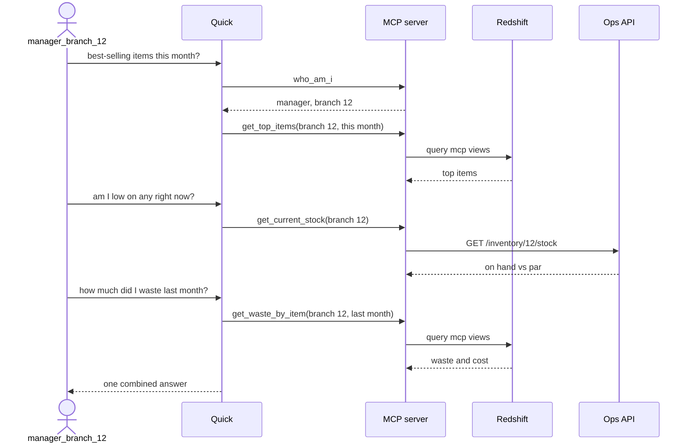

# D1 M07 — End-to-End (20m)

## Demo script
As `manager_branch_12` in Quick:

1. "What are my best-selling items this month?" (Redshift)
2. "Am I low on any of them right now?" (Ops API)
3. "How much of those did I waste last month and what did it cost?" (Redshift)

> **Screenshot** — `<SCREENSHOT_YET_TO_PREPARE>` Quick chat answering the three demo questions for branch 12 · save as `img/m07-quick-demo-answer.png`

Same questions in Kiro with bearer token.

What happens behind the three questions (tool names from the reference server):

Open full size: [PNG](img/diagrams/07-end-to-end-1.png) · [SVG](img/diagrams/07-end-to-end-1.svg)

## Recap
- Built: local MCP → Redshift + API tools → container → ECS → OAuth → Quick + Kiro.
- Analyst-owned: SQL patterns, tool descriptions, review.
- Pre-built / platform-owned: infra, auth middleware, Cognito setup.

## Bridge to Day 2
What did we have to build and run ourselves? ALB, ECS, Cognito wiring, API wrapper code, auth middleware. Day 2: how much of that AgentCore removes.
