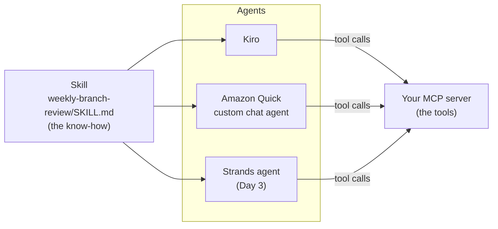

# D1 M08 — Skills and Agents in Kiro and Quick (45m)

You built **tools** (the MCP server). Now package **know-how** as a skill, and give it to two agents that use your tools.

## Objectives
- Tell apart an MCP server, a skill and an agent.
- Write a skill as a `SKILL.md` file, in plain markdown.
- Use the same skill in Kiro and in Amazon Quick, with the MCP server you deployed.

## Tools, skills and agents

| | What it is | Where it lives | In this workshop |
|---|---|---|---|
| **MCP server** | **Tools**: actions and data access | A running service | Your server on ECS (M05–M06) |
| **Skill** | **Know-how**: step-by-step instructions, loaded only when a request needs them | A folder with a `SKILL.md` file (the open Agent Skills format) | `weekly-branch-review`, written in this module |
| **Agent** | A model that follows instructions and skills and calls tools, in a loop | Inside a product (Kiro, Quick), or your own code (Day 3) | Kiro, a Quick custom chat agent; on Day 3, a Strands agent |



Open full size: [PNG](img/diagrams/08-skills-and-agents-1.png) · [SVG](img/diagrams/08-skills-and-agents-1.svg)

A skill is not a service: there is nothing to deploy. You **share** it (a folder in a repo, in Kiro, in Quick). Agents find it by its `description`, and only then load the full instructions.

## Steps

1. **Read the skill format (5m).** A skill is a folder whose name matches the skill's `name`, with a `SKILL.md` inside: YAML front matter with `name` and `description`, then the instructions in markdown. Open the reference: `solutions/skills/weekly-branch-review/SKILL.md`. Notice the description says **when** to use the skill, and the instructions name the **tools** and the **report format**.

2. **Write your skill (10m).** Create it in Kiro's workspace skills folder, from the workshop folder:

    ```bash
    mkdir -p .kiro/skills/weekly-branch-review
    ```

    ```powershell
    New-Item -ItemType Directory -Force .kiro\skills\weekly-branch-review | Out-Null
    ```

    Then, in the **Kiro chat panel**, ask: *"Write `.kiro/skills/weekly-branch-review/SKILL.md`: a skill for a weekly review of one branch, using our MCP tools who_am_i, find_branch, get_daily_branch_sales, get_top_items, get_waste_by_item and list_low_stock_items. Follow the Agent Skills format (name and description in the front matter). Sections: headline, sales by day, best sellers, waste, items low right now, one suggestion. Under 250 words, every number from a tool."* Review it like code: are the tool names right? Does the description say when to use it? Behind or short on time: copy the reference instead, `cp -r solutions/skills/weekly-branch-review .kiro/skills/` (PowerShell: `Copy-Item -Recurse solutions\skills\weekly-branch-review .kiro\skills\`).

3. **Use it in Kiro (5m).** With your deployed server connected (`rst-remote-ecs`, signed in as `manager_branch_12`, M06), ask in a new chat: *"How did my branch do last week?"* Kiro should pick the skill from its description; you can also call it directly with `/weekly-branch-review`. Check the report follows your sections and that Kiro called the tools the skill lists.

    > **Screenshot** — `<SCREENSHOT_YET_TO_PREPARE>` Kiro chat running the weekly-branch-review skill, with tool calls and the report · save as `img/m08-kiro-skill.png`

4. **Use it in Quick Desktop (5m).** Customize → **Skills** → **Create** → **From folder**, choose `.kiro/skills/weekly-branch-review`, review, then save. Choose **Try it** and ask *"How did my branch do last week?"*. Quick uses the MCP connector you installed in M06 Part C.

    > **Screenshot** — `<SCREENSHOT_YET_TO_PREPARE>` Quick Desktop skill detail panel for weekly-branch-review · save as `img/m08-quick-desktop-skill.png`

5. **Build a Quick custom chat agent (15m).** In Quick web: **Chat agents** → **Create chat agent** → **Skip** (to the builder):
    - **Name:** `Branch review assistant`. **Description:** *Weekly reviews and live stock for branch managers.*
    - **Persona instructions:** *You help branch managers of a restaurant chain review their branch. Use the restaurant MCP tools for every number; never guess. For weekly reviews, follow the attached weekly-branch-review instructions.*
    - **Reference documents:** upload your `SKILL.md`. (Web chat agents have no skills field, so the skill's instructions go in as a reference document.)
    - **Actions:** **Link** → choose the MCP connector from M06 Part C → select its actions → **Link**.
    - **Customization → Suggested prompts:** *How did my branch do last week?* and *What am I low on right now?*
    - Choose **Update preview**, try the suggested prompts in the preview, then **Launch chat agent**. Optional: **Share** it with another participant.

    > **Screenshot** — `<SCREENSHOT_YET_TO_PREPARE>` Quick chat agent builder with Persona instructions, the SKILL.md reference document and the MCP connector linked under Actions · save as `img/m08-quick-chat-agent.png`

6. **Compare (5m).** Ask the same question in Kiro and in the Quick agent, signed in as the same user. The tools are the same, the skill is the same, the agents differ. What differs in the answers, and why?

## Checkpoint
- `.kiro/skills/weekly-branch-review/SKILL.md` exists, and Kiro answers *"How did my branch do last week?"* with the skill's sections and real numbers.
- The `Branch review assistant` chat agent in Quick is launched, with the MCP connector linked, and answers the same question for branch 12 only (signed in as `manager_branch_12`).

## Discussion
- **Who owns what?** Analysts can own skills (markdown, reviewed like code) as well as tools. Changing the report format is a skill edit, not a code change.
- **Skill or tool?** If it needs data or an action, it is a tool. If it is "how we do this task", it is a skill.
- **Sharing:** Quick skills can be published and shared with a group; Kiro skills travel with the repo (`.kiro/skills/`). On Day 3 the Strands agent loads the same folder.

## Instructor notes
- Timing: 45m = 5 + 10 + 5 + 5 + 15 + 5. If Quick Desktop is not installed, skip step 4; step 5 covers Quick.
- Quick custom chat agents need the permission to create chat agents (an admin setting) and the MCP connector from M06 Part C. The skill's description is what makes Kiro and Quick pick it automatically: a vague description means it is never used.
- Kiro: workspace skills live in `.kiro/skills/`; the folder name must match `name`. Custom Kiro agents only load skills listed in their `resources` (`skill://.kiro/skills/*/SKILL.md`); the default agent loads workspace skills.
