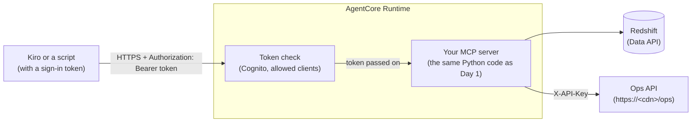

# D2 M02 — AgentCore Runtime (60m)

On Day 1 you ran the MCP server yourself: a container on ECS, a load balancer, CloudFront, and sign-in checks in your code. **AgentCore Runtime** runs the same server for you. You give it your code and a few settings; it packages the code, runs it when a request comes in, and checks the sign-in token before your code sees the request.

## Objectives
- Deploy your Day 1 MCP server to AgentCore Runtime, without changing its code.
- Reuse the Day 1 Cognito sign-in: Runtime checks the token, and your server still reads the user's role and branch from it.
- Call the server on Runtime from the terminal and from Kiro.

## How it fits together



Open full size: [PNG](img/diagrams/02-runtime-1.png) · [SVG](img/diagrams/02-runtime-1.svg)

| Day 1 (ECS) | Day 2 (Runtime) |
|---|---|
| Dockerfile, image build, ECS service | `agentcore deploy` zips your code and uploads it |
| ALB + CloudFront for HTTPS | Runtime gives you an HTTPS address |
| `lib/auth.py` checks every token | Runtime checks it first; your server checks it again (defence in depth) and reads `role` / `branch_id` |
| Task role `rst-mcp-task-<region>` | The **same** role, so Redshift access (`mcp_reader`) is unchanged |
| Settings in the ECS task definition | Settings in `agentcore/agentcore.json` (`envVars`) |

## Before you start
- Day 1 is finished and `RstMcpStack` is deployed with auth on (M06 step 7). Your terminal has `AWS_PROFILE` and `AWS_REGION` set, as in Day 1 M05.
- **Check that the Ops API is reachable from outside your VPC.** AgentCore runs outside your Day 1 VPC, and on Day 1 the Ops API (`mock-api`) was internal only. Current versions of `RstMcpStack` also publish it at `https://<cdn>/ops` (it still needs the API key on every call) and show it as the stack output `OpsApiUrl`. Check:

    ```bash
    aws cloudformation describe-stacks --stack-name RstMcpStack --query "Stacks[0].Outputs[?OutputKey=='OpsApiUrl'].OutputValue" --output text
    ```

    ```powershell
    aws cloudformation describe-stacks --stack-name RstMcpStack --query "Stacks[0].Outputs[?OutputKey=='OpsApiUrl'].OutputValue" --output text
    ```

    - Prints `https://....cloudfront.net/ops`: nothing to do.
    - Prints nothing (`None`): your stack was deployed before this was added. Get the latest workshop code (`git pull`), then from `infra/` run **your M06 step 7 command again**, with the same `-c` options (leaving them out turns sign-in off). Without it, the server's live tools fail on Runtime, step 5's script stops, and M03 can't reach the Ops API.

- Have these from Day 1 at hand: your **user pool ID**, the **three app client IDs** (`kiro-user`, `quick-user`, `quick-s2s`), your **Cognito domain** and your **`McpUrl`**. M06 Part B step 6 shows the commands to list them.

> **Shared account?** Use your participant name everywhere today: project `rstday2<name>` (letters and digits only), and pass `--participant <name>` to the script in step 5.

## Steps

1. **Install the AgentCore CLI (5m).** It is a Node.js tool (you have Node from Day 1). No Python virtual environment is needed: the CLI uses `uv` to install your server's dependencies.

    ```bash
    npm install -g @aws/agentcore@0.31
    agentcore --version
    ```

    ```powershell
    npm install -g @aws/agentcore@0.31
    agentcore --version
    ```

    - If `agentcore` still shows an old version or `configure`/`launch` commands, an older Python tool with the same name is installed. Remove it with `pip uninstall bedrock-agentcore-starter-toolkit` (or `uv tool uninstall bedrock-agentcore-starter-toolkit`), then open a new terminal.
    - The CLI sends anonymous usage data. To turn it off: `agentcore config telemetry.enabled false`.

2. **Create an AgentCore project (5m).** From the workshop folder:

    ```bash
    agentcore create --project-name rstday2 --no-agent
    cd rstday2
    ```

    ```powershell
    agentcore create --project-name rstday2 --no-agent
    cd rstday2
    ```

    This makes a folder `rstday2/` with `agentcore/agentcore.json` (everything you deploy is described here) and `agentcore/cdk/` (the CLI deploys with CloudFormation, like Day 1). It also starts its own git repository inside the folder; that's expected. Project names are letters and digits only, up to 23 characters.

3. **Copy your MCP server into the project (2m).** Runtime deploys the code that is inside the project folder.

    ```bash
    mkdir -p app
    cp -r ../mcp-server app/RstMcp
    ```

    ```powershell
    New-Item -ItemType Directory -Force app | Out-Null
    Copy-Item -Recurse ..\mcp-server app\RstMcp
    ```

    Behind? Copy the reference server instead: `../solutions/mcp-server` (PowerShell: `..\solutions\mcp-server`). Your `.env` and `.venv` are copied too, but the CLI leaves them out of the upload.

4. **Describe the server to AgentCore (5m).** Still in `rstday2/`. Replace `<user pool id>` and the three client IDs (comma-separated, no spaces):

    ```bash
    agentcore add agent --name RstMcp --type byo --language Python --protocol MCP \
      --code-location app/RstMcp --entrypoint server.py \
      --authorizer-type CUSTOM_JWT \
      --discovery-url "https://cognito-idp.<region>.amazonaws.com/<user pool id>/.well-known/openid-configuration" \
      --allowed-clients "<kiro-user id>,<quick-user id>,<quick-s2s id>" \
      --request-header-allowlist Authorization
    ```

    ```powershell
    agentcore add agent --name RstMcp --type byo --language Python --protocol MCP `
      --code-location app/RstMcp --entrypoint server.py `
      --authorizer-type CUSTOM_JWT `
      --discovery-url "https://cognito-idp.<region>.amazonaws.com/<user pool id>/.well-known/openid-configuration" `
      --allowed-clients "<kiro-user id>,<quick-user id>,<quick-s2s id>" `
      --request-header-allowlist Authorization
    ```

    | Option | Meaning |
    |---|---|
    | `--type byo` | "Bring your own" code: use the folder as it is, don't generate a sample |
    | `--protocol MCP` | Runtime forwards MCP requests to your server on port 8000, path `/mcp` (what `server.py` already uses) |
    | `--authorizer-type CUSTOM_JWT`, `--discovery-url` | Accept only tokens from your Cognito user pool |
    | `--allowed-clients` | ...and only tokens issued to these app clients (Cognito puts the app client ID in the token's `client_id`) |
    | `--request-header-allowlist Authorization` | Pass the token on to your server. Without it, your server can't see who is calling, and branch scoping fails |

5. **Fill in the server's settings (5m).** On ECS, the stack gave the server its settings (Redshift workgroup, Ops API address and key, sign-in issuer). On Runtime they go into `agentcore.json`. A script reads them from your Day 1 stacks and writes them in. From the **workshop folder**:

    ```bash
    cd ..
    python3 scripts/configure_runtime.py rstday2
    ```

    ```powershell
    cd ..
    py scripts\configure_runtime.py rstday2
    ```

    It prints every value. Open `rstday2/agentcore/agentcore.json` and find them under `runtimes` → `envVars`, plus `executionRoleArn` (the Day 1 task role, so the server reads Redshift as `mcp_reader` exactly as on ECS). The promotions tools are not connected on Runtime: that service stays inside the Day 1 VPC.

    > **Secrets in settings.** The Ops API key is now a plain setting of the runtime: anyone who can read the runtime's configuration can see it. That's acceptable for the workshop's mock API. In M03 the Gateway keeps the key in the AgentCore Identity vault instead, where nobody reads it in plain text.

6. **Deploy (5m).**

    ```bash
    cd rstday2
    agentcore deploy -y
    ```

    ```powershell
    cd rstday2
    agentcore deploy -y
    ```

    The first deploy takes about 3–5 minutes. It ends with `Deployed to 'default'` and the runtime ARN (`arn:aws:bedrock-agentcore:<region>:<account>:runtime/rstday2_RstMcp-...`). In the console: **Amazon Bedrock AgentCore → Runtime** shows `rstday2_RstMcp` as **Ready**.

7. **Call it from the terminal (10m).** Get a sign-in token for `manager_branch_12` (the browser opens; sign in). The scope is your Day 1 `McpUrl` plus `/read`, so the same token works on ECS and on Runtime. For example, with `McpUrl` `https://d123abc.cloudfront.net/mcp` the scope line is `openid https://d123abc.cloudfront.net/mcp/read`, and `--domain` is the full address, such as `https://rst-mcp-yourname.auth.us-east-1.amazoncognito.com`. ([Sign-in and tokens, explained](../docs/sign-in-and-tokens.md) covers what a token is.)

    ```bash
    export RST_MCP_SCOPE="openid <McpUrl>/read"
    export RST_MCP_TOKEN=$(python3 ../scripts/get_token.py --domain <Cognito domain> --client-id <kiro-user id>)
    agentcore invoke call-tool --runtime RstMcp --tool who_am_i --input '{}' --bearer-token "$RST_MCP_TOKEN"
    ```

    ```powershell
    $env:RST_MCP_SCOPE = "openid <McpUrl>/read"
    $env:RST_MCP_TOKEN = (py ..\scripts\get_token.py --domain <Cognito domain> --client-id <kiro-user id>)
    agentcore invoke call-tool --runtime RstMcp --tool who_am_i --input '{}' --bearer-token "$env:RST_MCP_TOKEN"
    ```

    Expected: `"role": "manager"`, `"branch_id": 12`. Then try a data tool, asking for another branch:

    ```bash
    agentcore invoke call-tool --runtime RstMcp --tool get_top_items \
      --input '{"branch_id": 5, "start_date": "2026-09-01", "end_date": "2026-09-30", "top_n": 3}' --bearer-token "$RST_MCP_TOKEN"
    ```

    ```powershell
    agentcore invoke call-tool --runtime RstMcp --tool get_top_items `
      --input '{\"branch_id\": 5, \"start_date\": \"2026-09-01\", \"end_date\": \"2026-09-30\", \"top_n\": 3}' --bearer-token "$env:RST_MCP_TOKEN"
    ```

    You get branch 12's items and the note *"You can only view branch 12"*: branch scoping works on Runtime too, because the token reached your code. Without a token, Runtime refuses the call itself, before your code runs (`401`, `MissingAuthenticationTokenException`).

    > **Windows PowerShell 5.1** needs `\"` inside JSON arguments, as above. In PowerShell 7.3 or later, write the JSON as in the bash tab.

8. **Find the address and the logs (5m).**

    ```bash
    agentcore status
    agentcore logs --runtime RstMcp --since 15m
    ```

    ```powershell
    agentcore status
    agentcore logs --runtime RstMcp --since 15m
    ```

    `agentcore status` prints the runtime's **URL**: `https://bedrock-agentcore.<region>.amazonaws.com/runtimes/<encoded ARN>/invocations`. Add `?qualifier=DEFAULT` at the end for MCP clients (the qualifier picks the runtime endpoint; `DEFAULT` is your latest deploy): that is your **Runtime MCP URL**. The logs are your server's own log lines, as in CloudWatch on Day 1.

9. **Connect Kiro (10m).** Add an entry to `.kiro/settings/mcp.json` (workshop folder), with your Runtime MCP URL:

    ```json
    "rst-agentcore-runtime": {
      "url": "https://bedrock-agentcore.<region>.amazonaws.com/runtimes/<encoded ARN>/invocations?qualifier=DEFAULT",
      "headers": { "Authorization": "Bearer ${RST_MCP_TOKEN}" },
      "disabled": false
    }
    ```

    - Kiro only fills in `${RST_MCP_TOKEN}` if it is listed in the Kiro setting **Mcp Approved Env Vars**: open Settings, search for it, and add `RST_MCP_TOKEN`.
    - Kiro reads the variable from the environment it was started in. Start Kiro from the terminal where you set `RST_MCP_TOKEN` (`kiro .`), or set it in your shell profile.
    - Tokens expire after 1 hour. When tools start failing with `401`, get a new token (step 7) and reconnect the server in Kiro.

    In a new chat: *"Who am I, and what were my top 3 items last month?"* Check the tool calls go to `rst-agentcore-runtime`.

## Checkpoint
- `agentcore status` shows `RstMcp` **Deployed**, runtime **READY**.
- `who_am_i` through Runtime returns your test user's role and branch, and a manager asking for another branch gets their own branch with a note.
- Kiro lists the tools of `rst-agentcore-runtime` and answers a question with them.

## Discussion
- What disappeared compared with Day 1: Dockerfile builds, the ECS service, the load balancer, CloudFront, scaling settings. What stayed yours: the code, the SQL, the tool descriptions, the database grants.
- Runtime checked the token, and your server checked it again. Is the second check worth keeping? (Yes: it is also what reads `role` and `branch_id`.)
- Why does Kiro use a pasted token here instead of signing in like on Day 1? Runtime publishes its own sign-in metadata for its own address, and the Day 1 scope was created for your CloudFront address. M03 puts one Gateway address in front, which is what you would give users.

## Clean up
Keep the runtime for M03. To delete it at the end of the day: in `rstday2/`, `agentcore remove all -y`, then `agentcore deploy -y` (deploying an empty project deletes its AWS resources).

## Instructor notes
- Tested with `@aws/agentcore` 0.31.1. The CLI deploys through CDK, so accounts need the CDK bootstrap from Day 1 (it is reused).
- The first `agentcore deploy` in an account also turns on CloudWatch Transaction Search (used in M05); traces take about 10 minutes to appear the first time.
- `configure_runtime.py` finds the app clients by name (`kiro-user`, `quick-user`, `quick-s2s`, or with `-<participant>`). If participants named theirs differently, they can edit `OIDC_ALLOWED_AUDIENCES` in `agentcore.json`.
