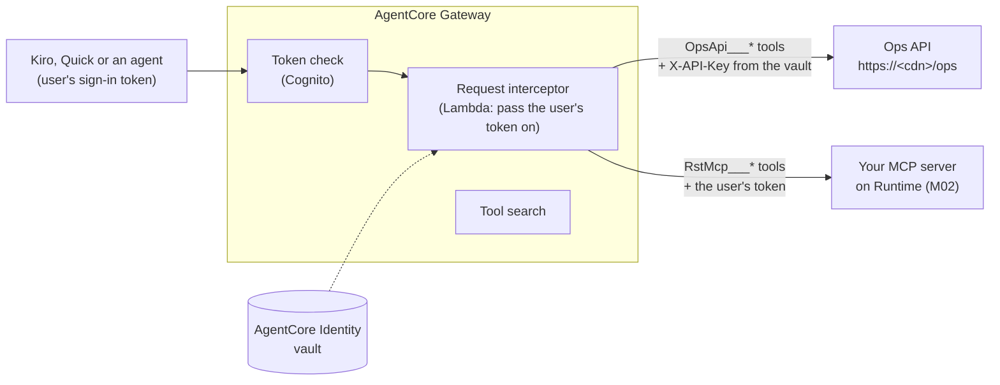

# D2 M03 — AgentCore Gateway (75m)

**AgentCore Gateway** gives your users one MCP address for many tool sources. Today it fronts two:

- the **Ops API**, turned into MCP tools straight from its OpenAPI file, with no code;
- your **MCP server on Runtime** from M02.

The Gateway checks the user's sign-in, keeps the API key and service credentials in a vault, and (M05) applies rules to every tool call.

## Objectives
- Create a Gateway that accepts your Day 1 Cognito sign-in.
- Add an OpenAPI target (the Ops API) and an MCP server target (your Runtime).
- Keep the user's identity all the way to your server, so branch scoping still works.
- Use the Gateway's tool search when the tool list gets long.

## How it fits together



Open full size: [PNG](img/diagrams/03-gateway-1.png) · [SVG](img/diagrams/03-gateway-1.svg)

Tool names on the Gateway are `<target>___<tool>` (three underscores): `OpsApi___getStockLevels`, `RstMcp___get_top_items`.

| Piece | What it does | Created by |
|---|---|---|
| Gateway | The one MCP address; checks the Cognito token | You (step 4) |
| API key credential provider | Keeps the Ops API key in the AgentCore Identity vault | You (step 3) |
| OAuth credential provider | Lets the Gateway sign in to Runtime as `quick-s2s` (to read the tool list) | You (step 3) |
| Gateway role `rst-gateway-role-<region>` | What the Gateway may do: read the vault, call the interceptor, ask the policy engine (M05) | `RstAgentCoreStack` (step 1) |
| Request interceptor `rst-gateway-interceptor` | A tiny Lambda that hands the **user's** token on to your server, so it knows who is asking | `RstAgentCoreStack` (step 1) |

## Before you start
- M02 is done: `agentcore status` shows `RstMcp` deployed, and `RST_MCP_TOKEN` works (get a new one if an hour has passed, M02 step 7).
- Go back to the **workshop folder** (the one with `infra/`, `scripts/` and `rstday2/`): M02 ended inside `rstday2/`, so run `cd ..`. All commands below start there, with `AWS_PROFILE` and `AWS_REGION` set.
- In commands, `$GATEWAY_ID` (PowerShell: `$env:GATEWAY_ID`) is a variable you set once in step 4. A new terminal forgets variables: see "New terminal?" at the end of step 4.

> **Shared account?** Add `--participant <name>` to the script in step 2, and use the names it prints (`rst-gateway-<name>` and so on).

## Steps

1. **Deploy the Gateway helpers (5m).** From `infra/`:

    ```bash
    cd infra
    npx cdk deploy RstAgentCoreStack
    cd ..
    ```

    ```powershell
    cd infra
    npx cdk deploy RstAgentCoreStack
    cd ..
    ```

    Shared account: `npx cdk deploy RstAgentCoreStack-<name> --exclusively -c participant=<name>`. Outputs: `GatewayRoleArn` and `InterceptorArn`. Open `infra/lambda/gateway_interceptor/index.py`: it is 10 lines.

2. **Write the input files (5m).** The AWS CLI commands below read their settings from JSON files, so you don't type long JSON (or fight quotes in PowerShell). A script fills them in from your stacks:

    ```bash
    python3 scripts/make_gateway_inputs.py rstday2
    ```

    ```powershell
    py scripts\make_gateway_inputs.py rstday2
    ```

    It writes five files to `rstday2/gateway/`. Open `gateway.json` and `target-ops-api.json` and find:

    - `authorizerConfiguration`: your user pool's discovery URL, the `kiro-user` and `quick-user` client IDs, and the scope `<McpUrl>/read`;
    - `protocolConfiguration` → `searchType: SEMANTIC` (step 7);
    - `interceptorConfigurations` with `passRequestHeaders: true`: the interceptor sees the user's `Authorization` header;
    - in `target-ops-api.json`, the whole `mock-api/openapi.yaml` as text, with `servers` set to your `OpsApiUrl`.

    > `api-key-provider.json` and `oauth-provider.json` contain secrets (the Ops API key and the `quick-s2s` client secret). `rstday2/` is in `.gitignore`. Delete the two files after step 3.

3. **Put the credentials in the vault (5m).**

    ```bash
    aws bedrock-agentcore-control create-api-key-credential-provider --cli-input-json file://rstday2/gateway/api-key-provider.json
    aws bedrock-agentcore-control create-oauth2-credential-provider --cli-input-json file://rstday2/gateway/oauth-provider.json
    ```

    ```powershell
    aws bedrock-agentcore-control create-api-key-credential-provider --cli-input-json file://rstday2/gateway/api-key-provider.json
    aws bedrock-agentcore-control create-oauth2-credential-provider --cli-input-json file://rstday2/gateway/oauth-provider.json
    ```

    Each prints a `credentialProviderArn`. In the console: **Amazon Bedrock AgentCore → Identity** lists both. Now delete the two files: `rm rstday2/gateway/api-key-provider.json rstday2/gateway/oauth-provider.json` (PowerShell: `Remove-Item rstday2\gateway\api-key-provider.json, rstday2\gateway\oauth-provider.json`).

4. **Create the Gateway (5m).** The gateway's name comes from `gateway.json`: `rst-gateway`, or `rst-gateway-<name>` if you gave `--participant <name>` in step 2 (open the file to check). The command keeps the new gateway's ID in a variable, `GATEWAY_ID`, for the next steps:

    ```bash
    export GATEWAY_ID=$(aws bedrock-agentcore-control create-gateway --cli-input-json file://rstday2/gateway/gateway.json \
      --query gatewayId --output text)
    export GATEWAY_URL=$(aws bedrock-agentcore-control get-gateway --gateway-identifier $GATEWAY_ID --query gatewayUrl --output text)
    echo $GATEWAY_ID $GATEWAY_URL
    ```

    ```powershell
    $env:GATEWAY_ID = (aws bedrock-agentcore-control create-gateway --cli-input-json file://rstday2/gateway/gateway.json `
      --query gatewayId --output text)
    $env:GATEWAY_URL = (aws bedrock-agentcore-control get-gateway --gateway-identifier $env:GATEWAY_ID --query gatewayUrl --output text)
    echo $env:GATEWAY_ID $env:GATEWAY_URL
    ```

    You see the **gateway ID** (`rst-gateway-abc123xyz`) and the **Gateway URL** (`https://rst-gateway-abc123xyz.gateway.bedrock-agentcore.<region>.amazonaws.com/mcp`).

    > **New terminal?** Variables are lost. Find your gateway again by its name (shared account: `rst-gateway-<name>`), and get a new `RST_MCP_TOKEN` (M02 step 7) with `RST_MCP_SCOPE` set. Every later module that uses the Gateway assumes `GATEWAY_ID`, `GATEWAY_URL` and `RST_MCP_TOKEN` are set.
    >
    > ```bash
    > export GATEWAY_ID=$(aws bedrock-agentcore-control list-gateways --query "items[?name=='rst-gateway'].gatewayId" --output text)
    > export GATEWAY_URL=$(aws bedrock-agentcore-control get-gateway --gateway-identifier $GATEWAY_ID --query gatewayUrl --output text)
    > ```
    >
    > ```powershell
    > $env:GATEWAY_ID = (aws bedrock-agentcore-control list-gateways --query "items[?name=='rst-gateway'].gatewayId" --output text)
    > $env:GATEWAY_URL = (aws bedrock-agentcore-control get-gateway --gateway-identifier $env:GATEWAY_ID --query gatewayUrl --output text)
    > ```

    Wait until the Gateway is ready (about 30 seconds):

    ```bash
    aws bedrock-agentcore-control get-gateway --gateway-identifier $GATEWAY_ID --query status --output text
    ```

    ```powershell
    aws bedrock-agentcore-control get-gateway --gateway-identifier $env:GATEWAY_ID --query status --output text
    ```

    Repeat until it prints `READY`.

5. **Add the two targets (10m).**

    ```bash
    aws bedrock-agentcore-control create-gateway-target --gateway-identifier $GATEWAY_ID \
      --cli-input-json file://rstday2/gateway/target-ops-api.json --query "[name,status]" --output text
    aws bedrock-agentcore-control create-gateway-target --gateway-identifier $GATEWAY_ID \
      --cli-input-json file://rstday2/gateway/target-runtime.json --query "[name,status]" --output text
    ```

    ```powershell
    aws bedrock-agentcore-control create-gateway-target --gateway-identifier $env:GATEWAY_ID `
      --cli-input-json file://rstday2/gateway/target-ops-api.json --query "[name,status]" --output text
    aws bedrock-agentcore-control create-gateway-target --gateway-identifier $env:GATEWAY_ID `
      --cli-input-json file://rstday2/gateway/target-runtime.json --query "[name,status]" --output text
    ```

    When a target is created, the Gateway reads its tools: from the OpenAPI file for `OpsApi`, and by asking your Runtime server (signed in as `quick-s2s`) for `RstMcp`. After about a minute, both should be `READY`:

    ```bash
    aws bedrock-agentcore-control list-gateway-targets --gateway-identifier $GATEWAY_ID \
      --query "items[].[name,status]" --output table
    ```

    ```powershell
    aws bedrock-agentcore-control list-gateway-targets --gateway-identifier $env:GATEWAY_ID `
      --query "items[].[name,status]" --output table
    ```

    `FAILED`? `aws bedrock-agentcore-control get-gateway-target --gateway-identifier $GATEWAY_ID --target-id <target id> --query statusReasons` (target IDs: `list-gateway-targets ... --query "items[].[name,targetId]"`) shows why. For `RstMcp`, the usual cause is that `quick-s2s` is not in the runtime's `--allowed-clients` (M02 step 4).

6. **Call tools through the Gateway (15m).** A small script calls any MCP address with your token (`RST_MCP_TOKEN` from M02) and the `GATEWAY_URL` from step 4:

    ```bash
    uv run --directory solutions/mcp-server python ../../scripts/mcp_call.py "$GATEWAY_URL" list
    uv run --directory solutions/mcp-server python ../../scripts/mcp_call.py "$GATEWAY_URL" call RstMcp___who_am_i
    ```

    ```powershell
    uv run --directory solutions/mcp-server python ..\..\scripts\mcp_call.py "$env:GATEWAY_URL" list
    uv run --directory solutions/mcp-server python ..\..\scripts\mcp_call.py "$env:GATEWAY_URL" call RstMcp___who_am_i
    ```

    `list` shows 33 tools: 10 `OpsApi___…` (one per `operationId`, the name each operation has in the OpenAPI file), 22 `RstMcp___…`, and `x_amz_bedrock_agentcore_search`. Four of the `RstMcp___` tools are the promotions tools: they are listed but return an error, because the promotions service isn't connected on Runtime (M02 step 5). `who_am_i` says `manager`, branch `12`: the interceptor passed **your** token to your server. Now compare the two ways to read live stock:

    ```bash
    uv run --directory solutions/mcp-server python ../../scripts/mcp_call.py "$GATEWAY_URL" call RstMcp___get_current_stock branch_id=5
    uv run --directory solutions/mcp-server python ../../scripts/mcp_call.py "$GATEWAY_URL" call OpsApi___getStockLevels branchId=5
    ```

    ```powershell
    uv run --directory solutions/mcp-server python ..\..\scripts\mcp_call.py "$env:GATEWAY_URL" call RstMcp___get_current_stock branch_id=5
    uv run --directory solutions/mcp-server python ..\..\scripts\mcp_call.py "$env:GATEWAY_URL" call OpsApi___getStockLevels branchId=5
    ```

    - `RstMcp___get_current_stock` returns **branch 12** with a note: your server's scoping.
    - `OpsApi___getStockLevels` returns **branch 5**. The API trusts the API key and has no idea who the user is. That is a hole; M05 closes it with a Gateway policy.

    Also compare the descriptions: the `OpsApi___` tools use the OpenAPI `summary` / `description`, your `RstMcp___` tools your docstrings. Which would a model pick for "how much chicken is left at my branch?"

7. **Tool search (5m).** With many tools, the model can ask the Gateway for the relevant ones instead of reading all of them:

    ```bash
    uv run --directory solutions/mcp-server python ../../scripts/mcp_call.py "$GATEWAY_URL" call x_amz_bedrock_agentcore_search "query=how much food did we throw away"
    ```

    ```powershell
    uv run --directory solutions/mcp-server python ..\..\scripts\mcp_call.py "$env:GATEWAY_URL" call x_amz_bedrock_agentcore_search "query=how much food did we throw away"
    ```

    The first result is `RstMcp___get_waste_by_item`, although the question never says "waste": the search reads the tool descriptions, which is one more reason to write them well.

8. **Connect Kiro (10m).** Add to `.kiro/settings/mcp.json`, with your Gateway URL, and disable `rst-agentcore-runtime` from M02 (its tools are now behind the Gateway):

    ```json
    "rst-gateway": {
      "url": "<your Gateway URL, from: echo $GATEWAY_URL>",
      "headers": { "Authorization": "Bearer ${RST_MCP_TOKEN}" },
      "disabled": false
    }
    ```

    As in M02, `RST_MCP_TOKEN` must be in **Mcp Approved Env Vars** and set where Kiro was started. Ask: *"Am I low on anything right now, and what were my top 3 items last month?"* Which target did Kiro use for "right now": `OpsApi___getStockLevels` or `RstMcp___list_low_stock_items`?

9. **Improve one description (10m, optional).** In `mock-api/openapi.yaml`, rewrite the `summary` and `description` of `getStockLevels` so it says it is **live, today's** stock and when to use it. Then run step 2 again and update the target:

    ```bash
    python3 scripts/make_gateway_inputs.py rstday2
    aws bedrock-agentcore-control list-gateway-targets --gateway-identifier $GATEWAY_ID --query "items[].[name,targetId]" --output text
    aws bedrock-agentcore-control update-gateway-target --gateway-identifier $GATEWAY_ID --target-id <OpsApi target id> \
      --cli-input-json file://rstday2/gateway/target-ops-api.json
    ```

    ```powershell
    py scripts\make_gateway_inputs.py rstday2
    aws bedrock-agentcore-control list-gateway-targets --gateway-identifier $env:GATEWAY_ID --query "items[].[name,targetId]" --output text
    aws bedrock-agentcore-control update-gateway-target --gateway-identifier $env:GATEWAY_ID --target-id <OpsApi target id> `
      --cli-input-json file://rstday2/gateway/target-ops-api.json
    ```

    The script also writes the two secret files again; delete them (the `rm` / `Remove-Item` line in step 3). No code changed, only the description: the analyst skill again.

## Checkpoint
- `list-gateway-targets` shows `OpsApi` and `RstMcp` as `READY`.
- Through the Gateway, `RstMcp___who_am_i` returns your test user, and `RstMcp___get_current_stock branch_id=5` returns branch 12 with a note.
- Kiro answers a question using `rst-gateway` tools.

## Troubleshooting
| Symptom | Cause |
|---|---|
| `403 insufficient_scope` on every call | Usually an **expired token** (they last 1 hour): get a new one. Otherwise the token lacks the scope `<McpUrl>/read` (`RST_MCP_SCOPE` in M02 step 7) |
| `401` | No token, or a token from another app client than `kiro-user` / `quick-user` |
| `RstMcp___who_am_i` says `hq`, `is_service: true` | The user's token didn't reach your server: the interceptor is missing from the Gateway, or `passRequestHeaders` is not `true` |
| Target `FAILED` | `get-gateway-target ... --query statusReasons`. OpsApi: is `OpsApiUrl` reachable (`curl <OpsApiUrl>/branches` gives `401` without a key)? RstMcp: see step 5 |
| Fewer than 33 tools in your own code | The Gateway returns the tool list in pages of 30. Read every page (`all_tools()` in `agent/src/rst_agent/connections.py` shows how) |

## Discussion
- Day 1 M03 Exercise A took Kiro, a spec and a review to wrap one API. The OpenAPI target took one command. When would you still hand-build a tool? (Combining several calls, reshaping answers, rules the API doesn't have.)
- The Ops API tools don't know the user; your MCP server does. Where should "a manager sees only their branch" live: in each API, in the MCP server, or in the Gateway (M05)?
- The Gateway reads your server's tool list as `quick-s2s` (no user). What could go wrong if your server listed different tools for different users?

## Instructor notes
- Tested with AWS CLI 2.34 and `@aws/agentcore` 0.31.1 in us-east-1.
- The interceptor is the documented way to pass the caller's token to an MCP server target: the Gateway itself won't forward `Authorization` (`metadataConfiguration` can't carry it). The OAuth provider (`quick-s2s`) is still needed: the Gateway uses it when it reads the target's tool list, with no user present.
- `make_gateway_inputs.py` sends branch IDs to the Gateway as text (`"12"`), not numbers. Cedar policies in M05 compare them with the token's `branch_id` claim, and claims are always text. The mock API accepts both.
- Delete in this order (end of Day 2 or Day 3): targets, gateway, credential providers. M05 adds the policy engine and log deliveries.
