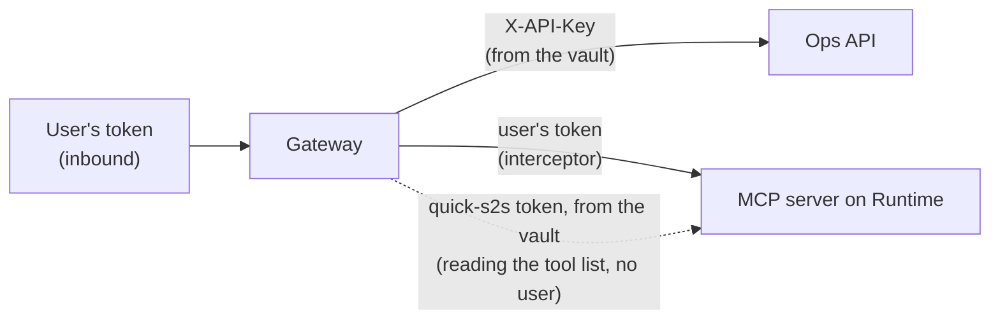

# D2 M04 — AgentCore Identity (30m)

In M03 you used three different credentials without writing any code for them. This module looks at where they live and who can use them. **AgentCore Identity** is the part of AgentCore that keeps outbound credentials (API keys, OAuth client secrets, users' OAuth tokens) in a vault and hands them to the Gateway or Runtime when needed.

## Objectives
- Tell inbound sign-in (who is calling) from outbound credentials (how the Gateway calls a target).
- Find where each credential from M03 is stored, and which role may read it.
- Know the ways a target can learn who the user is, and which one to use when.

## Inbound and outbound

| | Question | In this workshop |
|---|---|---|
| **Inbound** | Who is calling the Gateway or Runtime? | The user's Cognito access token. The Gateway (and Runtime) check it: issuer, app client, scope, expiry |
| **Outbound** | How does the Gateway sign in to each target? | `OpsApi`: the API key from the vault. `RstMcp`: a `quick-s2s` token from the vault, plus the user's own token passed on by the interceptor |



Open full size: [PNG](img/diagrams/04-identity-1.png) · [SVG](img/diagrams/04-identity-1.svg)

## Steps

> **Shared account?** Your names carry your participant name: `rst-ops-api-key-<name>`, `rst-runtime-s2s-<name>`, and the role `rst-gateway-role-<name>-<region>`.

1. **Find the credentials (10m).**

    ```bash
    aws bedrock-agentcore-control list-api-key-credential-providers --query "credentialProviders[].name" --output text
    aws bedrock-agentcore-control list-oauth2-credential-providers --query "credentialProviders[].[name,credentialProviderVendor]" --output text
    aws bedrock-agentcore-control get-api-key-credential-provider --name rst-ops-api-key
    ```

    ```powershell
    aws bedrock-agentcore-control list-api-key-credential-providers --query "credentialProviders[].name" --output text
    aws bedrock-agentcore-control list-oauth2-credential-providers --query "credentialProviders[].[name,credentialProviderVendor]" --output text
    aws bedrock-agentcore-control get-api-key-credential-provider --name rst-ops-api-key
    ```

    The last command shows an `apiKeySecretArn`: the key itself is a secret in AWS Secrets Manager, named `bedrock-agentcore-identity!default/apikey/rst-ops-api-key-...`. The `get` command never returns the key. In the console: **Amazon Bedrock AgentCore → Identity**, then **Secrets Manager → Secrets** (search `bedrock-agentcore-identity`).

2. **Who may use them (10m).** Open **IAM → Roles → `rst-gateway-role-<region>`** (created by `RstAgentCoreStack`, defined in `infra/lib/agentcore-stack.ts`). Find:

    - `bedrock-agentcore:GetResourceApiKey` and `GetResourceOauth2Token`: the Gateway may ask the vault for these credentials;
    - `secretsmanager:GetSecretValue` only on secrets named `bedrock-agentcore-identity!*`: it can't read any other secret;
    - the **trust policy**: only the AgentCore service, for gateways in this account, may use the role.

    Fill in the table, in pairs:

    | Credential | Day 1: where it lived | Day 2: where it lives | Who can read it |
    |---|---|---|---|
    | Ops API key | | | |
    | `quick-s2s` client secret | | | |
    | User's token | | | |

    <details>
    <summary>Answer</summary>

    | Credential | Day 1 | Day 2 | Who can read it |
    |---|---|---|---|
    | Ops API key | Secrets Manager, given to the ECS task as an environment variable | Identity vault (`rst-ops-api-key`) for the Gateway. Still also an environment variable of the Runtime server (M02) | The Gateway role; anyone who can read the runtime's settings |
    | `quick-s2s` client secret | Pasted into Quick (Day 1 M06 Part C) | Identity vault (`rst-runtime-s2s`) | The Gateway role |
    | User's token | Sent by Kiro / Quick to your server | Sent to the Gateway, passed on to your server by the interceptor | Nobody stores it; it expires after 1 hour |

    </details>

3. **How a target learns who the user is (10m, discussion).**

    | Way | What the target receives | Use when |
    |---|---|---|
    | **Service credentials** (API key, client credentials) | Only "the Gateway is calling" | The target has no per-user data (reference data, the tool list) |
    | **Pass the user's token on** (our interceptor) | The user's own token | Workshops and testing. The same token works at the Gateway and at the target, so keep its scope narrow |
    | **Token exchange (on-behalf-of)** | A new token for the target, issued for this user | Production: the target gets a token made for it, not a copy of the user's |
    | **User consent (3-legged OAuth)** | A token from **another** system, after the user agreed once (for example their calendar) | Tools that act in a SaaS on the user's behalf. The Gateway shows the user a consent link the first time; the vault keeps the token for next time |

    Discuss: the Ops API only ever sees the API key. Which way would let it check the user itself? Is that worth it, or is a Gateway policy (M05) enough?

## Checkpoint
You can say where the Ops API key and the `quick-s2s` secret are stored, which role may read them, and why `RstMcp___who_am_i` shows your user while the Ops API never sees one.

## Discussion
- The Runtime server from M02 still has the Ops API key as a plain setting. Two ways to remove it: call the Ops API through the Gateway instead, or read the key from the vault in code (with the AgentCore Identity SDK). Which is simpler for your team to run?
- Rotating the key: update the vault entry (`update-api-key-credential-provider`), no redeploy of the Gateway. Compare with Day 1 (new secret value, then restart the ECS tasks).

## Instructor notes
- 3-legged OAuth is shown as discussion only: it needs a second identity provider with consent screens and a callback URL registered in it. If you want to demo it, see *Outbound auth → OAuth 2.0 authorization code* in the AgentCore Gateway docs.
- Identity is free when used through Gateway or Runtime; you pay for the Secrets Manager secrets.
