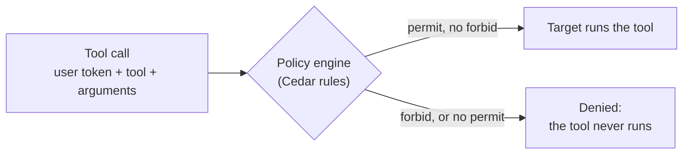

# D2 M05 — Policy and Observability (60m)

In M03 a branch 12 manager could read branch 5's live stock through `OpsApi___getStockLevels`: the Ops API only checks the API key. On Day 1 you would fix that with `if role != ...` in each tool. Here you write the rule **once**, in the Gateway, with **AgentCore Policy**. Then you look at the traces of the calls the policy allowed and refused.

## Objectives
- Write rules in Cedar that use the user's token (role, branch) and the tool's arguments.
- Try them in log-only mode, then enforce them.
- Find a refused call, and the slowest tool call, in the traces.

## How a policy decides



Open full size: [PNG](img/diagrams/05-policy-observability-1.png) · [SVG](img/diagrams/05-policy-observability-1.svg)

| Cedar word | In AgentCore Gateway |
|---|---|
| `principal` | The signed-in user (`AgentCore::OAuthUser`). Every token claim is a **tag**: `principal.getTag("role")`, `principal.getTag("branch_id")` (always text, e.g. `"12"`) |
| `action` | The tool, by its Gateway name: `AgentCore::Action::"OpsApi___getStockLevels"` |
| `resource` | Your gateway, by its ARN |
| `context.input` | The tool's arguments: `context.input.branchId` |
| `permit` / `forbid` | Nothing is allowed unless a `permit` matches. A matching `forbid` always wins |

## The four rules
Read them in `day2/policies/` before you start:

| File | Rule |
|---|---|
| `signed_in_users.cedar` | Anyone signed in with a role may call tools (the starting point) |
| `live_data_own_branch.cedar` | Live data and refunds on the Ops API: managers and staff only for their own branch; HQ any branch |
| `refunds_managers_only.cedar` | Refunds (through either target): managers and HQ only |
| `transfers_from_own_branch.cedar` | A manager may only send stock **from** their own branch; HQ any |

Your MCP server's tools (`RstMcp___...`) already limit data to the user's branch themselves (Day 1 M06 Part E). The rules add the same protection for the Ops API, which can't do it, and a second check on refunds.

## Before you start
- M03 is done, and you are in the workshop folder with `GATEWAY_ID`, `GATEWAY_URL`, `RST_MCP_SCOPE` and a fresh `RST_MCP_TOKEN` set (new terminal: M03 step 4 "New terminal?").
- **Switching users** (step 7): get a token for another test user with the same command as Day 2 M02 step 7, run from the workshop folder, and sign in as that user on the page that opens:

    ```bash
    export RST_MCP_TOKEN=$(python3 scripts/get_token.py --domain <Cognito domain> --client-id <kiro-user id>)
    ```

    ```powershell
    $env:RST_MCP_TOKEN = (py scripts\get_token.py --domain <Cognito domain> --client-id <kiro-user id>)
    ```
- In this module, `mcp_call` means `uv run --directory solutions/mcp-server python ../../scripts/mcp_call.py "$GATEWAY_URL"` (PowerShell: `uv run --directory solutions/mcp-server python ..\..\scripts\mcp_call.py "$env:GATEWAY_URL"`). Type the full command each time.

> **Shared account?** Name the engine `rst_policy_engine_<name>` (underscores, no hyphens), read every `rstday2/...` path as `rstday2<name>/...`, and add `--participant <name>` to the script in step 2 (shown under the command).

## Part A — Policy (35m)

1. **Create a policy engine (3m).** The engine holds the rules; you then attach it to the Gateway.

    ```bash
    aws bedrock-agentcore-control create-policy-engine --name rst_policy_engine --query "[policyEngineId,status]" --output text
    ```

    ```powershell
    aws bedrock-agentcore-control create-policy-engine --name rst_policy_engine --query "[policyEngineId,status]" --output text
    ```

    Keep its ID in a variable (shared account: `rst_policy_engine_<name>`), then check until it says `ACTIVE`:

    ```bash
    export ENGINE_ID=$(aws bedrock-agentcore-control list-policy-engines --query "policyEngines[?name=='rst_policy_engine'].policyEngineId" --output text)
    ```

    ```powershell
    $env:ENGINE_ID = (aws bedrock-agentcore-control list-policy-engines --query "policyEngines[?name=='rst_policy_engine'].policyEngineId" --output text)
    ```

    ```bash
    aws bedrock-agentcore-control get-policy-engine --policy-engine-id $ENGINE_ID --query status --output text
    ```

    ```powershell
    aws bedrock-agentcore-control get-policy-engine --policy-engine-id $env:ENGINE_ID --query status --output text
    ```

2. **Write the policy files (2m).** The script puts your gateway's ARN into each rule and writes the Gateway update files:

    ```bash
    python3 scripts/make_gateway_inputs.py rstday2 --policies
    # shared account: python3 scripts/make_gateway_inputs.py rstday2<name> --participant <name> --policies
    ```

    ```powershell
    py scripts\make_gateway_inputs.py rstday2 --policies
    # shared account: py scripts\make_gateway_inputs.py rstday2<name> --participant <name> --policies
    ```

    It writes `policy-*.json` (one per rule), `gateway-policy-log-only.json` and `gateway-policy-enforce.json` to `rstday2/gateway/`. It also writes the two secret files of M03 again: delete them (`rm rstday2/gateway/api-key-provider.json rstday2/gateway/oauth-provider.json`; PowerShell: `Remove-Item rstday2\gateway\api-key-provider.json, rstday2\gateway\oauth-provider.json`).

3. **Attach the engine in log-only mode (3m).** Rules are evaluated and logged, but nothing is blocked yet:

    ```bash
    aws bedrock-agentcore-control update-gateway --cli-input-json file://rstday2/gateway/gateway-policy-log-only.json --query status --output text
    ```

    ```powershell
    aws bedrock-agentcore-control update-gateway --cli-input-json file://rstday2/gateway/gateway-policy-log-only.json --query status --output text
    ```

    Wait for `READY` (`get-gateway`, as in M03 step 4).

4. **Add the four rules (5m).**

    ```bash
    for rule in signed_in_users live_data_own_branch refunds_managers_only transfers_from_own_branch; do
      aws bedrock-agentcore-control create-policy --policy-engine-id $ENGINE_ID --name $rule \
        --validation-mode FAIL_ON_ANY_FINDINGS --definition file://rstday2/gateway/policy-$rule.json \
        --query "[name,status]" --output text
    done
    ```

    ```powershell
    foreach ($rule in "signed_in_users", "live_data_own_branch", "refunds_managers_only", "transfers_from_own_branch") {
      aws bedrock-agentcore-control create-policy --policy-engine-id $env:ENGINE_ID --name $rule `
        --validation-mode FAIL_ON_ANY_FINDINGS --definition file://rstday2/gateway/policy-$rule.json `
        --query "[name,status]" --output text
    }
    ```

    After 20 seconds, all four should be `ACTIVE`:

    ```bash
    aws bedrock-agentcore-control list-policies --policy-engine-id $ENGINE_ID --query "policies[].[name,status]" --output table
    ```

    ```powershell
    aws bedrock-agentcore-control list-policies --policy-engine-id $env:ENGINE_ID --query "policies[].[name,status]" --output table
    ```

    `CREATE_FAILED`? `--query "policies[].[name,statusReasons]"` explains why. The engine checks each rule against the tools' real argument types before accepting it, for example:

    - *"the types Long and String are not compatible"*: comparing a number with a token claim (claims are text);
    - *"unable to guarantee safety of access to tag"*: use `principal.hasTag("x") && ...` before `getTag("x")`;
    - *"Overly Permissive"* / *"Overly Restrictive"*: the rule would allow or deny everything for some tool.

    Fix the `.cedar` file, run step 2 again, `delete-policy` the failed one, and create it again.

5. **Try it in log-only mode (3m).** As `manager_branch_12`, ask for branch 5's stock:

    ```bash
    uv run --directory solutions/mcp-server python ../../scripts/mcp_call.py "$GATEWAY_URL" call OpsApi___getStockLevels branchId=5
    ```

    ```powershell
    uv run --directory solutions/mcp-server python ..\..\scripts\mcp_call.py "$env:GATEWAY_URL" call OpsApi___getStockLevels branchId=5
    ```

    It still works (`OK`): log-only mode only records that the rules **would** refuse it. This is how you try rules on real traffic before they block anyone.

6. **Enforce (3m).**

    ```bash
    aws bedrock-agentcore-control update-gateway --cli-input-json file://rstday2/gateway/gateway-policy-enforce.json --query status --output text
    ```

    ```powershell
    aws bedrock-agentcore-control update-gateway --cli-input-json file://rstday2/gateway/gateway-policy-enforce.json --query status --output text
    ```

7. **Test the rules (15m).** Wait for `READY`, then fill in the table, switching users with `get_token.py`:

    | User | Call (after `mcp_call ... call`) | Expected |
    |---|---|---|
    | `manager_branch_12` | `OpsApi___getStockLevels branchId=12` | `OK` |
    | `manager_branch_12` | `OpsApi___getStockLevels branchId=5` | `DENIED ... live_data_own_branch` |
    | `analyst_hq` | `OpsApi___getStockLevels branchId=5` | `OK` |
    | `manager_branch_12` | `OpsApi___requestStockTransfer fromBranchId=5 toBranchId=12 itemId=1 qty=2` | `DENIED ... transfers_from_own_branch` |
    | `manager_branch_12` | `OpsApi___requestStockTransfer fromBranchId=12 toBranchId=5 itemId=1 qty=2` | `OK`, a `transferId` (this really creates a transfer in the mock API) |
    | `staff_branch_12` | `OpsApi___issueRefund branchId=12 orderId=1 reason=test` | `DENIED ... refunds_managers_only` |
    | `staff_branch_12` | `list` | 30 tools, not 33: `OpsApi___issueRefund`, `RstMcp___issue_refund` and `OpsApi___requestStockTransfer` are **hidden**, because staff can never call them |

    A denied call never reaches the Ops API. The message names the rule that refused it.

## Part B — Observability (25m)

1. **Turn on the Gateway's logs and traces (5m).** Gateways don't send them by default. First keep three more values in variables:

    ```bash
    export GATEWAY_ARN=$(aws bedrock-agentcore-control get-gateway --gateway-identifier $GATEWAY_ID --query gatewayArn --output text)
    export ACCOUNT=$(aws sts get-caller-identity --query Account --output text)
    echo $GATEWAY_ARN $ACCOUNT $AWS_REGION
    ```

    ```powershell
    $env:GATEWAY_ARN = (aws bedrock-agentcore-control get-gateway --gateway-identifier $env:GATEWAY_ID --query gatewayArn --output text)
    $env:ACCOUNT = (aws sts get-caller-identity --query Account --output text)
    echo $env:GATEWAY_ARN $env:ACCOUNT $env:AWS_REGION
    ```

    Then create the deliveries (shared account: add `-<name>` to the four names `rst-gateway-logs` and `rst-gateway-traces`, which must be unique in the account):

    ```bash
    LOG_GROUP=/aws/vendedlogs/bedrock-agentcore/gateway/APPLICATION_LOGS/$GATEWAY_ID
    aws logs create-log-group --log-group-name $LOG_GROUP
    aws logs put-delivery-source --name rst-gateway-logs --log-type APPLICATION_LOGS --resource-arn $GATEWAY_ARN
    aws logs put-delivery-destination --name rst-gateway-logs \
      --delivery-destination-configuration destinationResourceArn=arn:aws:logs:$AWS_REGION:$ACCOUNT:log-group:$LOG_GROUP
    aws logs create-delivery --delivery-source-name rst-gateway-logs \
      --delivery-destination-arn arn:aws:logs:$AWS_REGION:$ACCOUNT:delivery-destination:rst-gateway-logs
    aws logs put-delivery-source --name rst-gateway-traces --log-type TRACES --resource-arn $GATEWAY_ARN
    aws logs put-delivery-destination --name rst-gateway-traces --delivery-destination-type XRAY
    aws logs create-delivery --delivery-source-name rst-gateway-traces \
      --delivery-destination-arn arn:aws:logs:$AWS_REGION:$ACCOUNT:delivery-destination:rst-gateway-traces
    ```

    ```powershell
    $LogGroup = "/aws/vendedlogs/bedrock-agentcore/gateway/APPLICATION_LOGS/$env:GATEWAY_ID"
    aws logs create-log-group --log-group-name $LogGroup
    aws logs put-delivery-source --name rst-gateway-logs --log-type APPLICATION_LOGS --resource-arn $env:GATEWAY_ARN
    aws logs put-delivery-destination --name rst-gateway-logs `
      --delivery-destination-configuration destinationResourceArn=arn:aws:logs:$env:AWS_REGION:$env:ACCOUNT:log-group:$LogGroup
    aws logs create-delivery --delivery-source-name rst-gateway-logs `
      --delivery-destination-arn arn:aws:logs:$env:AWS_REGION:$env:ACCOUNT:delivery-destination:rst-gateway-logs
    aws logs put-delivery-source --name rst-gateway-traces --log-type TRACES --resource-arn $env:GATEWAY_ARN
    aws logs put-delivery-destination --name rst-gateway-traces --delivery-destination-type XRAY
    aws logs create-delivery --delivery-source-name rst-gateway-traces `
      --delivery-destination-arn arn:aws:logs:$env:AWS_REGION:$env:ACCOUNT:delivery-destination:rst-gateway-traces
    ```

    (In the console, the same is on the gateway's page: **Log delivery → Add** and **Tracing → Enable**.) Then repeat three calls from the Part A table: one allowed, one denied, and one `RstMcp___get_waste_by_item branch_id=12 start_date=2026-09-01 end_date=2026-09-30`.

2. **Read the logs (5m).** About a minute later:

    ```bash
    aws logs tail $LOG_GROUP --since 15m --format short
    ```

    ```powershell
    aws logs tail $LogGroup --since 15m --format short
    ```

    Each MCP request appears as "Started processing request", the method (`tools/call`), and the result or error.

3. **Read the traces (15m).** Traces are stored as *spans* in the log group `aws/spans` (M02's first `agentcore deploy` turned on CloudWatch Transaction Search). In the console: **CloudWatch → Logs Insights**, log group `aws/spans`, run:

    ```text
    fields @timestamp, name, durationNano / 1000000 as ms
    | filter name like /AgentCore/
    | sort @timestamp desc
    | limit 50
    ```

    One tool call is several spans: `AgentCore.Gateway.InboundAuth` (token check), `...Interceptor.Request`, `AgentCore.Policy.AuthorizeAction` (the policy decision), `AgentCore.Identity.GetResourceOauth2Token` (vault), `AgentCore.Gateway.TargetInvocation`, `AgentCore.Gateway.InvokeTool.<tool>`. Answer:

    - How long does the policy check take compared with the whole call?
    - Which tool call is slowest, and where is the time spent: Gateway, or the target? (Redshift queries are usually the slow part. Discuss: a tighter date range, `LIMIT`, or a pre-computed view.)
    - For a denied call, which spans are missing?

    Runtime traces (your MCP server) are on **CloudWatch → GenAI Observability → Bedrock AgentCore**. The first traces can take up to 10 minutes to appear.

## Checkpoint
- `list-policies` shows four `ACTIVE` rules and the gateway's `policyEngineConfiguration` mode is `ENFORCE`.
- Your Part A table matches the expected column.
- You found an `AgentCore.Policy.AuthorizeAction` span and the slowest tool call in `aws/spans`.

## Discussion
- Day 1 put `if role != "manager"` inside each tool. A central rule is one place to read, review and test, and a security reviewer can read Cedar without reading Python. What is still better kept in the tool? (Scoping that depends on data, such as "items in my region".)
- Rules see the tool's **arguments**, not its results. Why can't a policy say "only show rows for my branch" for a tool that returns all branches?
- Log-only first, then enforce: how long would you run log-only in production, and what would you look for in the logs?

## Clean up
At the end of the day (or after Day 3), delete in this order: the policy engine (detach it first), the log deliveries, M03's targets, gateway and credential providers, then M02's runtime and `RstAgentCoreStack`. The [AgentCore cheat sheet](../docs/agentcore-cheatsheet.md#delete-everything-in-this-order) has every command.

## Instructor notes
- Tested in us-east-1 with AWS CLI 2.34. Policy names allow letters, digits and `_` only.
- Each rule is validated against the tool schemas when it is created, which is why the Gateway's OpenAPI copy declares branch IDs as text (`make_gateway_inputs.py`).
- `x_amz_bedrock_agentcore_search` and the `RstMcp___` read tools are allowed by `signed_in_users.cedar`. With ENFORCE, a tool that no `permit` covers is denied and hidden.
