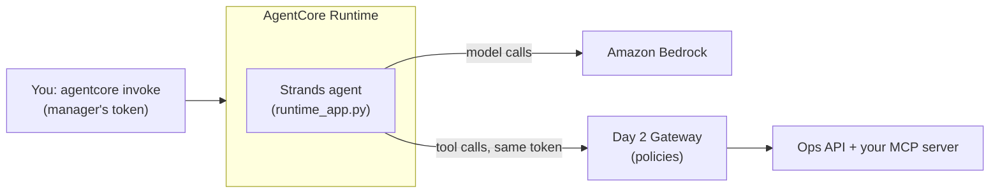

# D3 M05 — Deploy the agent (45m)

So far the agent ran in your terminal. Now it runs on **AgentCore Runtime**, like your MCP server on Day 2, and gets its tools from the **Day 2 Gateway**. A person still approves every action that changes data, but there is no terminal to type `y` into: the agent pauses and returns `needs_approval`, and the next call answers it.

## Objectives
- Host the M01–M03 agent on AgentCore Runtime, with the Day 2 Gateway as its tool source.
- Keep the user's identity end to end: Runtime checks the sign-in, and the Gateway and your server still see the real user.
- Keep the approval step without a terminal.
- Trace one run, and compare test scores through the Gateway with the local ones.

## What changes from M01–M03
Nothing in `rst_agent`. One file, [solutions/agent/runtime_app.py](../solutions/agent/runtime_app.py), wraps it for Runtime:

| Local chat (`python -m rst_agent`) | Runtime (`runtime_app.py`) |
|---|---|
| Starts the MCP server locally, or uses `MCP_URL` | `MCP_URL` = your Day 2 Gateway URL |
| You choose the user (`--role`, `--branch`) | The user comes from the sign-in token, and the token is passed on to the Gateway |
| `console_approver` asks "Approve? [y/N]" | The agent pauses and returns `needs_approval`; the next call sends `{"approve": true}` or `{"approve": false}` |
| One conversation per process | One agent per Runtime session ID |



Open full size: [PNG](img/diagrams/05-deploy-agent-1.png) · [SVG](img/diagrams/05-deploy-agent-1.svg)

## Before you start
- Day 2 M03 (and M05 for the policy part) is done: you have the **Gateway URL**, and `agentcore` is installed.
- A fresh `RST_MCP_TOKEN` for `manager_branch_12` (Day 2 M02 step 7). Commands start in the **workshop folder**.

> **Shared account?** Use project name `rstday3<name>`.

## Steps

1. **Read the entrypoint (5m).** Open `solutions/agent/runtime_app.py`: the payloads it accepts, the replies, and how `handle()` keeps one agent per session. Run its tests:

    ```bash
    cd solutions/agent
    uv run pytest -q tests/test_runtime_app.py
    cd ../..
    ```

    ```powershell
    cd solutions/agent
    uv run pytest -q tests/test_runtime_app.py
    cd ..\..
    ```

2. **Create the project (10m).** As on Day 2 M02, with the agent folder as the code:

    ```bash
    agentcore create --project-name rstday3 --no-agent
    cd rstday3
    mkdir -p app
    cp -r ../solutions/agent app/RstAgent
    agentcore add agent --name RstAgent --type byo --language Python --framework Strands --model-provider Bedrock \
      --code-location app/RstAgent --entrypoint runtime_app.py \
      --authorizer-type CUSTOM_JWT \
      --discovery-url "https://cognito-idp.<region>.amazonaws.com/<user pool id>/.well-known/openid-configuration" \
      --allowed-clients "<kiro-user id>" \
      --request-header-allowlist Authorization
    ```

    ```powershell
    agentcore create --project-name rstday3 --no-agent
    cd rstday3
    New-Item -ItemType Directory -Force app | Out-Null
    Copy-Item -Recurse ..\solutions\agent app\RstAgent
    agentcore add agent --name RstAgent --type byo --language Python --framework Strands --model-provider Bedrock `
      --code-location app/RstAgent --entrypoint runtime_app.py `
      --authorizer-type CUSTOM_JWT `
      --discovery-url "https://cognito-idp.<region>.amazonaws.com/<user pool id>/.well-known/openid-configuration" `
      --allowed-clients "<kiro-user id>" `
      --request-header-allowlist Authorization
    ```

    No `--protocol MCP` this time: the agent is an ordinary HTTP endpoint that takes a question and returns an answer (the default protocol). `--request-header-allowlist Authorization` lets the agent pass the caller's token on to the Gateway.

3. **Give it the Gateway URL and the model (5m).** Open `rstday3/agentcore/agentcore.json`. In the `RstAgent` runtime, set `runtimeVersion` to `PYTHON_3_12` and add `envVars`:

    ```json
    "runtimeVersion": "PYTHON_3_12",
    "envVars": [
      { "name": "MCP_URL", "value": "<Gateway URL>" },
      { "name": "BEDROCK_MODEL_ID", "value": "global.anthropic.claude-sonnet-5-5" }
    ],
    ```

    Keep the JSON valid: a comma after each item except the last. The execution role is created for you this time (no `executionRoleArn`): the agent needs Bedrock and logs, but no Redshift access, because data goes through the Gateway.

4. **Deploy (5m).**

    ```bash
    agentcore deploy -y
    ```

    ```powershell
    agentcore deploy -y
    ```

5. **Ask it a question as a branch manager (10m).** Session IDs must be at least 33 characters, so use a generated one:

    ```bash
    export SID=$(uuidgen)
    agentcore invoke --runtime RstAgent --session-id $SID --bearer-token "$RST_MCP_TOKEN" \
      "What were my top 3 items last month? Am I low on any of them right now?"
    ```

    ```powershell
    $env:SID = [guid]::NewGuid().ToString()
    agentcore invoke --runtime RstAgent --session-id $env:SID --bearer-token "$env:RST_MCP_TOKEN" `
      "What were my top 3 items last month? Am I low on any of them right now?"
    ```

    The reply has `"status": "done"`, the `answer`, and `tool_calls`: the same steps the recorder printed locally, now with Gateway names (`RstMcp___get_top_items`). The first call takes longer (Runtime starts the agent).

    Now the approval path, in the **same session**:

    ```bash
    agentcore invoke --runtime RstAgent --session-id $SID --bearer-token "$RST_MCP_TOKEN" \
      "Refund my most recent completed order today, the food was cold"
    # -> "status": "needs_approval", "pending": [{"tool": "RstMcp___issue_refund", "input": {...}}]
    agentcore invoke --runtime RstAgent --session-id $SID --bearer-token "$RST_MCP_TOKEN" '{"approve": false}'
    ```

    ```powershell
    agentcore invoke --runtime RstAgent --session-id $env:SID --bearer-token "$env:RST_MCP_TOKEN" `
      "Refund my most recent completed order today, the food was cold"
    # -> "status": "needs_approval", "pending": [{"tool": "RstMcp___issue_refund", "input": {...}}]
    agentcore invoke --runtime RstAgent --session-id $env:SID --bearer-token "$env:RST_MCP_TOKEN" '{\"approve\": false}'
    ```

    The answer says nothing was refunded. Then get a token for `staff_branch_12`, start a new session, ask for the same refund and **approve** it (`{"approve": true}`): the Day 2 rule `refunds_managers_only` still refuses it. A person approves; the policy decides what is allowed. (Watch what the agent tries next: it may look for another refund tool with the Gateway's search. The same rule covers both.)

6. **Trace it (5m).** **CloudWatch → GenAI Observability → Bedrock AgentCore** → your agent → **Sessions**, pick your session: the question, each model call, each Gateway tool call, the answer. The logs: `agentcore logs --runtime RstAgent --since 15m` (in `rstday3/`). The Gateway's own spans (policy decisions) are in `aws/spans`, as in Day 2 M05 Part B.

7. **Compare scores (5m).** Run the M04 question set with the tools coming from the Gateway instead of the local server. Each persona needs its own token (sign in as each user with `get_token.py`):

    ```bash
    cd ../evals
    export MCP_URL=<Gateway URL>
    export MCP_TOKEN_HQ=... MCP_TOKEN_MANAGER_BRANCH_12=... MCP_TOKEN_MANAGER_BRANCH_5=... MCP_TOKEN_STAFF_BRANCH_12=...
    uv run python run_evals.py --label "via Gateway"
    uv run python score.py results/latest.json
    ```

    ```powershell
    cd ..\evals
    $env:MCP_URL = "<Gateway URL>"
    $env:MCP_TOKEN_HQ = "..."; $env:MCP_TOKEN_MANAGER_BRANCH_12 = "..."
    $env:MCP_TOKEN_MANAGER_BRANCH_5 = "..."; $env:MCP_TOKEN_STAFF_BRANCH_12 = "..."
    uv run python run_evals.py --label "via Gateway"
    uv run python score.py results/latest.json
    ```

    Expect the **live** questions (q09–q11) to differ: your ground truth came from the local mock API with its clock pinned (M04 step 4), and the Gateway reads the deployed one. History questions should score as before. Did the agent ever pick an `OpsApi___` tool where you expected a `RstMcp___` one?

## Checkpoint
- `agentcore invoke` answers a question as `manager_branch_12`, with `tool_calls` going through the Gateway.
- A refund pauses with `needs_approval`; declining it leaves the order unchanged; a staff user is refused even when approved.

## Discussion
- Gateway names tools `<target>___<tool>`. Did the scores change because of tool names, descriptions (OpenAPI `summary` vs your docstrings) or the model? How do you tell?
- What did Runtime take away (process, scaling, the sign-in check), and what stayed yours (prompt, tools, approval rule, tests)?
- Where would the approval prompt live for real users: Quick, a web app, a ticket? `needs_approval` is the hook for any of them.

## Clean up
In `rstday3/`: `agentcore remove all -y`, then `agentcore deploy -y` (an empty project deletes its AWS resources). Do the same in `rstday2/` when you no longer need the Day 2 runtime, after deleting the Gateway (Day 2 M05 "Clean up").

## Instructor notes
- Tested with `@aws/agentcore` 0.31.1, `strands-agents` 1.57.2, `bedrock-agentcore` 1.24.0 and `global.anthropic.claude-sonnet-5-5` in us-east-1.
- `agentcore invoke '<text>'` always sends `{"prompt": "<text>"}`. `runtime_app.py` treats a prompt that is a JSON object (such as `{"approve": false}`) as the payload itself.
- Runtime installs the dependencies from `pyproject.toml` but not the project's own package, so `runtime_app.py` adds `src/` to the import path.
- `ApprovalHook` and `score.py` match tool names on the part after `___`, and `WRITE_TOOLS` includes the OpenAPI operation IDs `issueRefund` / `requestStockTransfer`, so write tools through the Gateway still pause for approval.

## Learn more
- Runtime + Gateway pattern adapted from *Building with Amazon Bedrock* (Workshop Studio), AgentCore labs "Runtime: Deploy" and "Gateway + Runtime".
- Observability walkthrough adapted from *Building an Enterprise Agentic AI Platform on Amazon Bedrock AgentCore*, Module 4 "Observe the Platform".
- [AgentCore Runtime](https://docs.aws.amazon.com/bedrock-agentcore/latest/devguide/agents-tools-runtime.html), [Observability](https://docs.aws.amazon.com/bedrock-agentcore/latest/devguide/observability.html).
