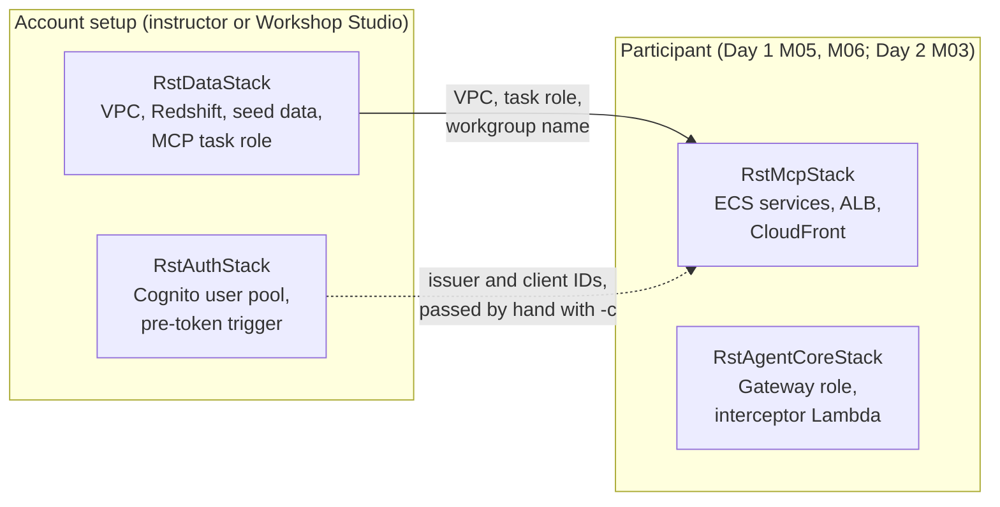

# CDK infrastructure (`infra/`)

Everything the workshop runs in AWS is defined with the AWS CDK (TypeScript) in [`infra/`](../infra/). This page explains how the folder is laid out, what each stack creates, who deploys it, and every `-c` option the guides use.

You don't need to write CDK in the workshop. You need to know which stack to deploy, with which options, and what to look at when something fails.

## Folder layout

| Path | What it is |
|---|---|
| [`bin/app.ts`](../infra/bin/app.ts) | The CDK app: reads the `-c` options, checks them, and creates the four stacks |
| [`lib/data-stack.ts`](../infra/lib/data-stack.ts) | `RstDataStack`: network, Redshift with the mock data, the MCP server's IAM role |
| [`lib/auth-stack.ts`](../infra/lib/auth-stack.ts) | `RstAuthStack`: the Cognito user pool (and, as catch-up, everything from M06 Part B) |
| [`lib/mcp-stack.ts`](../infra/lib/mcp-stack.ts) | `RstMcpStack`: the MCP server and the two internal apps on ECS, behind CloudFront |
| [`lib/agentcore-stack.ts`](../infra/lib/agentcore-stack.ts) | `RstAgentCoreStack` (Day 2): the AgentCore Gateway's IAM role and request interceptor |
| [`lambda/seed/handler.py`](../infra/lambda/seed/handler.py) | Custom resource that loads the mock data into Redshift and grants access |
| [`lambda/pre_token/index.py`](../infra/lambda/pre_token/index.py) | Cognito trigger that copies `role` and `branch_id` into the access token |
| [`lambda/gateway_interceptor/index.py`](../infra/lambda/gateway_interceptor/index.py) | Gateway request interceptor (Day 2): passes the caller's token on to the MCP server target |
| [`test/test_seed_handler.py`](../infra/test/test_seed_handler.py) | Unit tests for the seed handler |
| [`cdk.json`](../infra/cdk.json) | How to run the app (`ts-node bin/app.ts`) and the default value of each option |
| `package.json` | CDK versions (`aws-cdk-lib`, `aws-cdk` CLI). Run `npm install` once |

The stacks use files outside `infra/` too: `data/` (seed generator and SQL, used by the seed Lambda), and `mcp-server/`, `mock-api/`, `legacy-app/` (each built into a container image by `RstMcpStack`).

## The stacks



Open full size: [PNG](img/diagrams/infra-1.png) · [SVG](img/diagrams/infra-1.svg)

`RstMcpStack` uses the VPC and task role from `RstDataStack` directly (a CloudFormation cross-stack reference), so `RstDataStack` must be deployed first and can't be deleted while an `RstMcpStack` exists. `RstAuthStack` is not linked in code: in M06 you copy its values into `RstMcpStack` with `-c` options.

### `RstDataStack`

| Resource | Why |
|---|---|
| VPC in 3 AZs, 1 NAT gateway; subnets `public`, `app` (private, with internet out), `data` (isolated) | Redshift Serverless needs 3 AZs. ECS runs in `app`, Redshift in `data` |
| Redshift Serverless namespace and workgroup `rst-workshop`, database `dev`, base capacity 8 RPU, 60 s query limit | The data the MCP tools read. Not publicly reachable |
| Secrets Manager secret `RedshiftAdmin` | The admin password, used only by the seed step |
| S3 bucket and a COPY role | The seed step writes CSV files here and Redshift loads them |
| IAM role `rst-mcp-task-<region>` | The MCP server's identity. It may call the Redshift Data API on this workgroup only, and is mapped to the database role `mcp_reader`. ECS and AgentCore Runtime (Day 2) can use it; it may also write Runtime logs, traces and metrics |
| Custom resource `Seed` (Lambda `lambda/seed/handler.py`) | Creates the tables and `mcp` views, loads the mock data, creates `mcp_reader` and grants it to the task role and to `localDevRoleNames` |

The seed reloads data only when the files in `data/` change or you pass a different `seedEndDate`. It re-applies access (grants) on every deploy.

Outputs: `WorkgroupName`, `DatabaseName`, `AdminSecretArn`.

### `RstAuthStack`

| Resource | Created when |
|---|---|
| User pool `rst-workshop` (no self sign-up, password minimum 8, custom attributes `role` and `branch_id`) | Always |
| Pre token generation trigger (Lambda `lambda/pre_token/index.py`) | Always |
| Cognito domain `rst-mcp-<account id>` (managed login) | `-c fullAuth=true` or `-c sharedDomain=true` |
| Resource server `rst-mcp` (identifier = `mcpResourceUrl`, scopes `read` and `write`), app clients `quick-s2s`, `quick-user`, `kiro-user`, a managed login style for each user-facing client | `-c fullAuth=true` |

With neither option, participants build the domain, resource server and clients by hand in [M06 Part B](../day1/06-auth.md). `fullAuth` is the catch-up and the instructor dry-run.

Outputs: always `UserPoolId`, `OidcIssuer`; with the options, also `CognitoDomain`, `ReadScope`, `QuickS2sClientId`, `QuickUserClientId`, `KiroUserClientId` and `AllowedAudiences` (the three client IDs, comma-separated).

### `RstMcpStack`

```
Internet → CloudFront (HTTPS) → VPC origin → internal ALB → ECS Fargate: mcp-server (2 tasks)
                                                            ECS Fargate: mock-api, legacy-app (Cloud Map, internal only)
```

| Resource | Why |
|---|---|
| ECS cluster with Cloud Map namespace `rst.local` (shared account: `<participant>.rst.local`) | The MCP server finds the internal apps as `mock-api.rst.local` and `legacy-app.rst.local` |
| Three Fargate services, 0.25 vCPU / 512 MiB each, ARM64 by default | `mcp-server` (2 tasks, port 8000), `mock-api` (8080), `legacy-app` (8081). Images are built from the folders on your laptop (Docker or Finch) |
| Secrets `OpsApiKey`, `PromoApiToken` | API keys of the two internal apps, given to the containers as environment variables |
| Internal Application Load Balancer, health check `/health` | Never public. Only reachable from inside the VPC. Paths `/ops/*` go to `mock-api` (Day 2), everything else to the MCP server |
| CloudFront distribution with a VPC origin | Gives HTTPS on `*.cloudfront.net` without a custom domain or certificate. `https://<cdn>/mcp` is the MCP server; `https://<cdn>/ops` the Ops API (still needs its `X-API-Key`), for AgentCore, which runs outside the VPC |
| Log groups, one per service, kept one week | CloudWatch Logs, used in M05 and M07 |

Auth is off until you pass `oidcIssuer` (M06 step 7). Then the stack sets `OIDC_ISSUER`, `OIDC_ALLOWED_AUDIENCES`, `OIDC_REQUIRED_SCOPES` and `MCP_PUBLIC_URL` on the MCP server, which turns token checking on.

Outputs: `McpUrl`, `OpsApiUrl`, `McpPublicUrlNote` (says whether auth is on), `OpsApiKeySecretArn`, `PromoApiTokenSecretArn`.

### `RstAgentCoreStack` (Day 2)

| Resource | Why |
|---|---|
| IAM role `rst-gateway-role-<region>` | The role the AgentCore Gateway runs as: read its credentials from the AgentCore Identity vault (and only `bedrock-agentcore-identity!*` secrets), call the interceptor, ask the policy engine |
| Lambda `rst-gateway-interceptor` | Request interceptor: hands the caller's `Authorization` header on to the targets, so the MCP server knows the user |

The Gateway, its targets, credential providers and policies are not in CDK: participants create them with the AWS CLI in Day 2 M03–M05. Outputs: `GatewayRoleArn`, `InterceptorArn`. Shared account: `RstAgentCoreStack-<participant>`.

## Options (`-c key=value`)

Defaults are in `cdk.json`. Options are not remembered between deploys: **pass the same options every time** you deploy a stack, or the stack goes back to the default (for example, leaving out `oidcIssuer` turns auth off again).

| Option | Stack | Default | What it does |
|---|---|---|---|
| `seedEndDate` | Data | `2026-09-30` | Last day of mock orders, `YYYY-MM-DD`. Set it to the day before the workshop |
| `localDevRoleNames` | Data | empty | Extra IAM role names (comma-separated) that may query Redshift as `mcp_reader`, for running the MCP server on laptops |
| `fullAuth` | Auth | `false` | `true`: also create domain, resource server, app clients and styles (catch-up) |
| `sharedDomain` | Auth | `false` | `true`: create only the domain (shared-account mode) |
| `mcpResourceUrl` | Auth | empty | With `fullAuth`: the resource server identifier, the `McpUrl` of the `RstMcpStack` in this account. Empty: `rst-mcp`, scope `rst-mcp/read` |
| `quickCallbackUrls` | Auth | empty | With `fullAuth`: Quick's redirect URL for `quick-user` |
| `mcpServerDir` | MCP | `../mcp-server` | Which server to build. `../solutions/mcp-server` is the catch-up |
| `cpuArch` | MCP | `ARM64` | `X86_64` if your laptop can only build x86 images |
| `oidcIssuer` | MCP | empty | `https://cognito-idp.<region>.amazonaws.com/<user pool id>`. Set: auth on |
| `oidcAllowedAudiences` | MCP | empty | The app client IDs allowed to call the server, comma-separated, no spaces |
| `oidcRequiredScopes` | MCP | `rst-mcp/read` | The scope every token must have: `<McpUrl>/read` |
| `participant` | MCP, AgentCore | empty | Shared account: your short name (2–20 lowercase letters and digits). The stacks become `RstMcpStack-<participant>` and `RstAgentCoreStack-<participant>` |

`bin/app.ts` checks `seedEndDate` and `participant` before anything is deployed, so a typo fails at once with a clear message.

## Common commands

Run from `infra/`, with your profile and region set (see [M05](../day1/05-deploy-ecs.md)):

```bash
npm install                          # once
npx cdk list                         # the stacks this app defines
npx cdk diff RstMcpStack             # what a deploy would change
npx cdk deploy RstMcpStack           # deploy (add the same -c options every time)
npx cdk destroy RstMcpStack          # delete your server stack
```

```powershell
npm install                          # once
npx cdk list                         # the stacks this app defines
npx cdk diff RstMcpStack             # what a deploy would change
npx cdk deploy RstMcpStack           # deploy (add the same -c options every time)
npx cdk destroy RstMcpStack          # delete your server stack
```

- **Finch instead of Docker:** set `CDK_DOCKER=finch` before deploying.
- **Shared account:** add `--exclusively -c participant=<name>` and use `RstMcpStack-<name>`. `--exclusively` stops CDK from also deploying `RstDataStack`, which belongs to the instructor.
- **Wrong region:** CDK uses `CDK_DEFAULT_REGION`, from your profile or `AWS_REGION`. If a deploy goes to an unexpected region, check `echo $AWS_REGION`.
- **Deleting everything** (instructor, after the event): first the AgentCore resources (Day 2 M05 and Day 3 M05 "Clean up"), then `RstAgentCoreStack` and `RstMcpStack` (all participant stacks), then `RstAuthStack` and `RstDataStack`.

## Troubleshooting

| Symptom | Likely cause |
|---|---|
| `Cannot connect to the Docker daemon` / image build fails | Docker or Finch not running, or `CDK_DOCKER=finch` not set |
| `exec format error` in ECS logs | Image built for the wrong CPU. `-c cpuArch=X86_64` sets both the image build and the ECS task to x86; leave it at the default `ARM64` unless your laptop can't build ARM images |
| `Export ... cannot be deleted as it is in use` | You tried to delete or change `RstDataStack` while an `RstMcpStack` uses it. Delete `RstMcpStack` first |
| Deploy stuck on the MCP service, then rolls back | Tasks fail their health check. Read the `mcp-server` log group in CloudWatch |
| Auth turned off after a redeploy | The `oidc*` options were left out. Redeploy with them |
| `RstAuthStack` catch-up fails on the domain or resource server | You already created them by hand in M06 Part B. See the catch-up note there |
