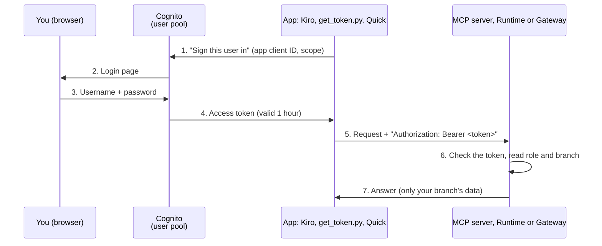

# Sign-in and tokens, explained

From Day 1 Module 06 on, every call to your MCP server, the AgentCore Runtime and the Gateway carries a **token**. This page explains what a token is, where it comes from, what the servers check, and what the common errors mean. No prior OAuth knowledge needed.

## The idea in one picture



Open full size: [PNG](img/diagrams/sign-in-and-tokens-1.png) · [SVG](img/diagrams/sign-in-and-tokens-1.svg)

The **user pool** (Cognito) is the only place that knows passwords. Apps never see them: they get a **token** instead and send it with every request. The server trusts the token because Cognito signed it.

## Words you will see

| Word | Plain meaning | In this workshop |
|---|---|---|
| **User pool** | Cognito's list of users and its sign-in service | `rst-workshop` (stack `RstAuthStack`) |
| **App client** | One app that may sign users in, with its own ID | `kiro-user`, `quick-user`, `quick-s2s` (Day 1 M06 Part B) |
| **Access token** | A signed, time-limited pass the app sends with each request | What `get_token.py` prints; starts with `eyJ` |
| **JWT** (JSON Web Token) | The token format: three parts separated by dots, the middle part is readable JSON | `python scripts/get_token.py ... --decode` shows the middle part |
| **Claim** | One field inside the token | `username`, `client_id`, `role`, `branch_id`, `scope`, `exp` |
| **Scope** | What the token may be used for | `<McpUrl>/read`: "may read the restaurant MCP server" |
| **Issuer** | Who signed the token | `https://cognito-idp.<region>.amazonaws.com/<user pool id>` |
| **Bearer token** | "Whoever holds this may use it", sent as `Authorization: Bearer <token>` | The `headers` entries in Kiro's `mcp.json` |
| **Inbound** | Checking the token of whoever calls **you** | Runtime and Gateway authorizers, `lib/auth.py` |
| **Outbound** | The credential **you** use to call something else | The Ops API key, the `quick-s2s` secret (Day 2 M04) |

## What a token looks like inside

```json
{
  "iss": "https://cognito-idp.us-east-1.amazonaws.com/us-east-1_AbCdEf123",
  "client_id": "5fmfu9950v...",
  "username": "manager_branch_12",
  "role": "manager",
  "branch_id": "12",
  "scope": "openid https://d123abc.cloudfront.net/mcp/read",
  "exp": 1791380000
}
```

- `role` and `branch_id` are not standard: the workshop's pre-token trigger (`infra/lambda/pre_token/index.py`) copies them from the user's attributes into every token. Branch scoping reads them.
- Every claim is **text**, even `branch_id`. That's why the Day 2 policy rules compare `"12"`, not `12`.
- `exp` is the expiry time. Tokens last **1 hour**.

## What each server checks

| Server | Checks | Configured in |
|---|---|---|
| Your MCP server (`lib/auth.py`) | Signature, issuer, expiry, `client_id` in `OIDC_ALLOWED_AUDIENCES`, scope `OIDC_REQUIRED_SCOPES` | Day 1 M06 step 7 (`-c oidc...`), Day 2 M02 step 5 (`envVars`) |
| AgentCore Runtime | Signature, issuer (from the discovery URL), expiry, `client_id` in `allowedClients` | Day 2 M02 step 4 (`agentcore add agent ...`) |
| AgentCore Gateway | The same, plus `allowedScopes` | Day 2 M03 step 2 (`gateway.json`) |
| Gateway policy (Cedar) | Claims as tags: `principal.getTag("role")` | Day 2 M05 |

## Getting a token

```bash
export RST_MCP_SCOPE="openid <McpUrl>/read"
python3 scripts/get_token.py --domain <Cognito domain> --client-id <kiro-user id> --decode   # shows the claims
export RST_MCP_TOKEN=$(python3 scripts/get_token.py --domain <Cognito domain> --client-id <kiro-user id>)
```

```powershell
$env:RST_MCP_SCOPE = "openid <McpUrl>/read"
py scripts\get_token.py --domain <Cognito domain> --client-id <kiro-user id> --decode   # shows the claims
$env:RST_MCP_TOKEN = (py scripts\get_token.py --domain <Cognito domain> --client-id <kiro-user id>)
```

The browser opens the sign-in page every time (so you can switch users). Sign in as the user you want; `--decode` confirms who it is.

## Common errors

| You see | Usually means | Fix |
|---|---|---|
| `401` / `MissingAuthenticationTokenException` | No token sent | Set `RST_MCP_TOKEN`; check the `headers` line in `mcp.json` |
| `401` after it worked before | The token expired (1 hour) | Get a new token |
| `403 insufficient_scope` from the Gateway | Often also an **expired token**; otherwise the token lacks `<McpUrl>/read` | New token, with `RST_MCP_SCOPE` set |
| `invalid_scope` on the sign-in page | The app client isn't allowed that scope | Tick `<McpUrl>/read` under **Custom scopes** on the app client (Day 1 M06 Part B) |
| `who_am_i` says `hq` with `is_service: true` | The server got a service token, not yours | Day 2 M03: the interceptor must be on the Gateway |
| Signed in as the wrong user | The browser reused the last sign-in | `get_token.py` always shows the login page; in Kiro see Day 1 M06 "Switching test users" |

## Keep tokens safe
A token is a password for one hour: don't paste it into chats, tickets or files you commit. `RST_MCP_TOKEN` lives only in your terminal session.
